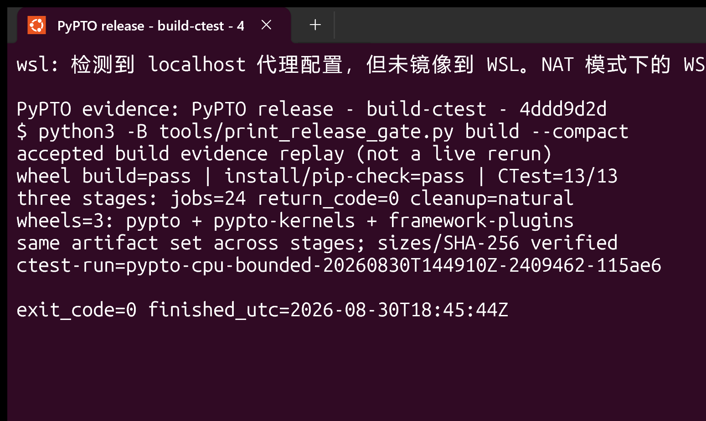
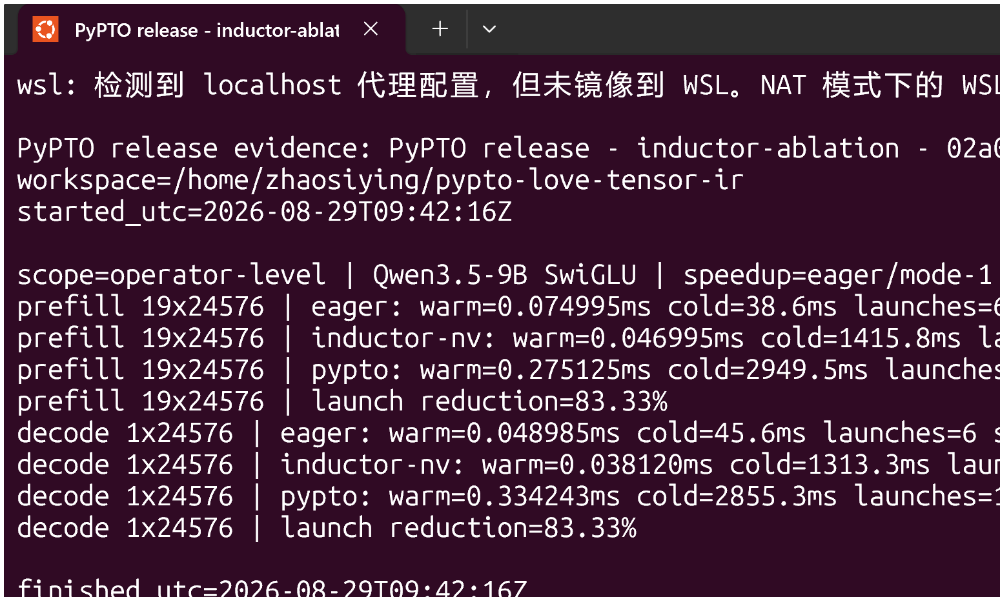

# PyPTO LOVE TensorIR: Qwen3.5 on an RTX 5090

[简体中文](README.md) | [English](README_EN.md)

> [!IMPORTANT]
> This is a personal, non-commercial compiler research project. Running PyPTO
> on an NVIDIA card appears to conflict with the CANN Open Software License
> Agreement Version 2.0,
> which places explicit restrictions on use and distribution for non-Huawei AI
> processors. Non-commercial intent, a public interview statement, or a
> takedown promise is not a license exception. The work does not represent
> Huawei, NVIDIA, PyTorch, or SGLang. Rights holders may contact the author
> through the repository Issues to request removal. See LEGAL_NOTICE.md.
>
> Interview attribution (approximately 2 h 34 min):
> https://www.bilibili.com/video/BV1nB3u6tERu/?vd_source=f2f41aa7b5e3cc8e0a23942779ccea11

This project has two core features:

1. PyPTO DSL/HIR is lowered through typed TensorIR ODS/OpBuilder to NVIDIA
   TensorIR, then through CUDA Tile and tileiras to an SM120 Cubin.
2. A standard torch.compile(backend="pypto") TorchInductor backend turns
   eligible pointwise/reduction subgraphs into PyPTO DSL.

The single execution path is:

~~~text
SGLang -> pypto-kernels + TorchDynamo/Inductor -> PyPTO HIR
       -> typed TensorIR ModuleOp -> CUDA Tile -> tileiras -> sm_120a Cubin
       -> PyPTO Artifact/NvidiaExecutable -> caller-owned CUDA stream
~~~


## Measured Status

Platform: NVIDIA GeForce RTX 5090 Laptop GPU (SM120, 24 GiB). Workload:
Qwen3.5-9B text-only, non-thinking chat template, 31 input tokens, 64 greedy
output tokens, BF16, TP1, concurrency 1.

| Item | Measured status |
|---|---|
| 9B correctness/coverage | Three fresh starts on the current wheel completed 10/10 Engine requests and one strict teacher-forced trace each |
| Model-forward coverage | Accepted traces: 33,448 compute calls = 31,400 handwritten PyPTO + 2,048 Inductor PyPTO, with zero unknown/fallback calls (100%) |
| 0.8B current wheel | Stock reference plus three candidate fresh starts completed; each trace covers 22,108/22,108 calls = 20,572 handwritten + 1,536 Inductor |
| PyPTO output throughput | **Formal resource-qualified pair: 2.4124 tok/s** (median of four fresh starts) |
| Matched SGLang | **Formal resource-qualified pair: 15.3708 tok/s** (same workload/controls) |
| PyPTO / matched | **15.695%**, 95% bootstrap CI **[15.634%, 15.753%]**; signed change versus matched **-84.305%** |
| Pair acceptance | `accepted=true`; all eight starts stayed above the 4 GiB GPU-free/12 GiB host-free floors with zero control mismatches |
| Cold/compile-trigger | PyPTO `16164.45/29252.20 ms`; matched `15316.70/23815.46 ms`; PyPTO is **22.83%** higher for the latter (includes one full 31+64 request, not compiler-only) |
| Historical invalidated pair | Old `2.6671/15.4100 tok/s`, 17.31% moved to `qwen35-9b-performance-pair-invalidated-20260830.json` for diagnostics only |
| Optimized SGLang | Not reported; this CUDA-graph capture reached 4000 MiB free and was stopped by the 4096 MiB controller floor (run `pypto-gpu-bounded-20260831T034327Z-2531381-964f87`) |

The non-promoted optimized probes are retained in the same diagnostic sidecar:
`0.68` left the GDN state cache unable to serve one request; `0.685` reached
2454 MiB free during graph capture; 3/4 GiB CPU offload reached 4088/3784 MiB
before the floor. None produced a performance report, and the formal 2 GiB
offload/0.69 configuration is unchanged. The official memory-saver dependency
is absent from the locked environment, while post-capture KV sizing is
incompatible with the formal disabled-prefill-graph contract; no temporary
package install or serving-mode change was used to bypass the gate.

Artifact-union versus model-forward compute intersection for accepted traces:

| model | total calls | handwritten | Inductor | unknown/fallback | coverage |
|---|---:|---:|---:|---:|---:|
| Qwen3.5-0.8B | 22,108 | 20,572 | 1,536 | 0 | 100% |
| Qwen3.5-9B | 33,448 | 31,400 | 2,048 | 0 | 100% |

Formal four-start end-to-end medians (each start first reduced to a ten-request p50):

| lane | E2E | TTFT | TPOT | output tok/s | cold engine | first compile-trigger request |
|---|---:|---:|---:|---:|---:|---:|
| PyPTO | 26529.17 ms | 3159.24 ms | 370.86 ms | 2.4124 | 16164.45 ms | 29252.20 ms |
| matched | 4163.75 ms | 70.10 ms | 64.97 ms | 15.3708 | 15316.70 ms | 23815.46 ms |

The first compile-trigger request includes compilation and one complete 31+64
request; it is not compiler-only time. The formal pair's minimum GPU free memory
was `5,123,887,104 B` and minimum host availability was `47,233,052 KiB`; all
eight starts passed both floors without thermal throttling. Both lanes used
`cpu_offload_gb=2` and `mem_fraction_static=0.78`, and listed controls had zero
mismatches. The previous invalidated pair is retained separately at
`state/evidence/qwen35-9b-performance-pair-invalidated-20260830.json` and must
not be mixed with the formal result. Qualification and pair binding are recorded
in `state/evidence/matched-performance-qualification-current.json`. The
controller stops its own run if a protected workload appears and never signals
an external process. The
matched lane keeps
enable_torch_compile=true but disables CUDA graphs, so this pinned SGLang
version does not invoke the global CompilerInterface; the report records
backend_invocation_observed=false. The PyPTO SwiGLU hook observes two generated
Inductor wrappers containing pypto_launch.

Machine-readable sources (including the two model-gate sidecars):

- state/evidence/qwen35-9b-performance-pair-current.json
- state/evidence/qwen35-0.8b-model-gate-current.json
- state/evidence/qwen35-9b-model-gate-current.json
- state/evidence/qwen35-9b-operator-performance-breakdown-current.json
- state/evidence/qwen35-9b-inductor-ablation-current.json
- state/evidence/qwen35-9b-inductor-source-current.json

One full-model eager control was also run with torch.compile disabled while
keeping the matched providers: output 15.3418 tok/s and E2E 4171.67 ms. The
formal matched compile-request median is 15.3708 tok/s and 4163.75 ms, but disabling
CUDA graphs prevents the pinned SGLang CompilerInterface/Inductor invocation.
This is therefore not a causal whole-model compile speedup; the timing-only
record is state/evidence/qwen35-9b-eager-compile-ablation-current.json.

These are measured implementation results, not performance targets. Fewer
launches do not automatically mean lower latency; current dominant costs are
handwritten matmul/LM-head and PyPTO launch/schedule overhead.

## Why TensorIR Fits as the PyPTO Backend

[PyPTO](https://github.com/hw-native-sys/pypto) owns the user DSL, HIR, static
specialization, artifact/cache, and runtime. [TensorIR](https://github.com/NVIDIA/tensor-ir)
is a tensor-level, tile-aware MLIR compiler frontend for layout propagation,
tiling, graph splitting, and TensorIR-to-CUDA-Tile lowering. CUDA Tile is the
downstream GPU IR/toolchain target; TensorIR is neither CUDA Tile nor a cuTile
runtime.

A PyPTO tile shape can continue lowering only when shape, dtype, element
stride, layout, iteration space, and mutation/alias ABI are static and pass
the TensorIR verifier. The bridge creates a TypedTensorIrModuleSpec, then uses
mlir::OpBuilder and ODS *Op::create to construct ModuleOp. Text printing is
only canonical serialization and diagnostics. Dynamic or overlapping strides,
unsupported contractions, invalid result anchors, and illegal alignment fail
closed.

| PyPTO fact | TensorIR representation | Required condition |
|---|---|---|
| pl.range / tile | iteration space / tile sizes | statically bounded |
| pl.load/store/view | typed slice/reshape/transpose/gather/scatter | access and layout verifiable |
| pl.InOut | read-write operand and mutation metadata | alias and result agree |
| matmul/reduce/broadcast | ODS operations | supported rank, dtype, contraction |

## Implementation

### PyPTO -> TensorIR

The bridge provides NVIDIA TargetInfo and SM120/runtime discovery; immutable
CompileRequest, CanonicalSchedule, and KernelBuildSpec; cache identity over
shape/dtype/stride/mutation/toolchain; typed GraphOp/stride attributes/results
and verification; pointwise, row reduction, BF16/FP32 matmul, norms,
gather/scatter, RoPE, dense/paged attention, KV writes, causal Conv1D, GDN
projection/recurrent lowering; Cubin/ABI/grid/workspace checks; and
NvidiaExecutable process/device/CUcontext/current-stream lifetime checks.

Key files are .sources/pypto/src/codegen/nvidia/tensor_ir_codegen.cpp,
.sources/pypto/src/codegen/nvidia/typed_tensor_ir_module_spec.h, and
.sources/pypto/src/compiler/nvidia_typed_tensor_ir_builder.cpp. Canonical
NVIDIA construction rejects source-string concatenation; lint and negative
geometry verifier tests are part of the regression contract.

### TorchInductor -> PyPTO

The plugin registers torch_dynamo_backends=pypto and calls full compile_fx.
Within a context-local scope it replaces CUDA scheduling and wrapper dispatch,
then restores the official backend. Strict mode disables fallback. The adapter
records node-body load/op/store sequences, preserves real row-pitched strides,
creates @pl.jit graphs, launches through pypto_launch on the current stream,
and records callable/artifact/prewarm caches, stable source hashes, and CUPTI
external correlation.

The complete Qwen MLP is not fused:

~~~text
handwritten gate/up linear -> one Inductor-generated PyPTO SwiGLU
                              -> handwritten down linear
~~~

Only the packed gate/up FP32 casts, sigmoid, two multiplies, and BF16 cast are
automatically fused.

## Handwritten Operator Library

packages/pypto-kernels is independent of the SGLang plugin. Its 15 Python
modules contain 18 @pl.jit graphs for dense/masked/paged attention, paged
gather/KV write/prefill, causal Conv1D, recurrent GDN, GDN projection, Q/K
RMSNorm plus partial RoPE and gate, embedding/integer gather, BF16 linear,
BF16-rounded FP32 LM head, three RMSNorm variants, RoPE, sigmoid-mul, and
SiLU-mul.

The most complex representative is
[gdn_recurrent_kernel](packages/pypto-kernels/src/pypto_kernels/gdn.py). It
combines pl.InOut, static loops, row reduction/broadcast, FP32 matmul, and
outer-product state updates. Long prefill advances state in token order; it is
not presented as one mega-kernel.

## Ablation and Breakdown

Fixed Qwen3.5-9B SwiGLU shape, 20 warmups and 100 CUDA-event calls:

| phase/mode | warm ms | first call ms | events | vs eager |
|---|---:|---:|---:|---:|
| prefill 19x24576 eager | 0.042966 | 35.25 | 6 | 0 |
| prefill official NV Inductor | 0.032915 | 1098.33 | 1 | +30.54% |
| prefill PyPTO Inductor | 0.210618 | 1696.24 | 1 | -79.60% |
| decode 1x24576 eager | 0.040543 | 32.81 | 6 | 0 |
| decode official NV Inductor | 0.033808 | 1045.90 | 1 | +19.92% |
| decode PyPTO Inductor | 0.212401 | 1733.25 | 1 | -80.91% |

Both compiled modes reduce six events to one (83.33% launch reduction).
PyPTO's first call is 54.44% longer than official NV Inductor for prefill and
65.72% longer for decode.

Aligned eight-start operator A/B (four starts per lane):

| case | PyPTO latency / stock |
|---|---:|
| SwiGLU decode / prefill | 23.52x / 23.47x |
| gate-up linear decode / prefill | 10.89x / 180.02x |
| down linear decode / prefill | 37.11x / 189.69x |
| FP32 LM head | 6.10x |

These are logically aligned microbenchmarks. They explain why the current
whole-model result is slower despite fewer pointwise launches; they are not a
claim that PyPTO is faster.

### Whole-model CUPTI descriptive breakdown

The strict three-lane compiled profile (PyPTO, matched, optimized) remains a
separate gate. To provide auditable phase evidence now, we collected three
PyPTO and three `sglang-matched` fresh starts, with five profile requests per
start and 64 `ModelRunner.forward` windows per request. The matched lane keeps
`enable_torch_compile=true`, but disabling CUDA Graphs prevents this pinned
SGLang build from invoking `CompilerInterface`. The table is therefore
descriptive stock-CUDA CUPTI activity, not Inductor compilation or a speedup
claim.

| forward compute (GPU activity duration per request) | PyPTO p50 | stock matched p50 | delta |
|---|---:|---:|---:|
| all compute | 22.318812 ms | 1.285792 ms | +21.033020 ms |
| `unattributed_compute` | 20.184082 ms | 0.435080 ms | +19.749002 ms |
| `attention_core_gate` | 1.154360 ms | 0.003228 ms | +1.151132 ms |
| `lm_head` | 0.931866 ms | 0 ms (no same-name correlation) | +0.931866 ms |

`unattributed_compute`, and a zero stock value, do not mean that an operator
did not execute. They mean that the current external-correlation/module-hook
rules did not map the activity to the same logical name. The phase-delta sum is
`21.031480 ms`; the `1.539578 ms` residual against the total is a median-
estimator reconciliation residual. Full phases, confidence intervals, every
raw CUPTI trace SHA, and resource boundaries are in
[`qwen35-9b-descriptive-stock-profile-breakdown-current.json`](state/evidence/qwen35-9b-descriptive-stock-profile-breakdown-current.json).
Rebuild it explicitly with the following mode (the strict three-lane matrix is
unchanged):

```bash
envs/pypto-release/bin/python tools/profile_qwen35.py collect \
  --lane sglang-matched --model-path models/Qwen3.5-9B \
  --optimized-memory-mode matched --allow-noncompiled-matched
envs/pypto-release/bin/python tools/profile_qwen35.py reconcile \
  --allow-noncompiled-matched \
  --profile pypto=runs/<pypto-start>/qwen35-9b-profile-pypto.json \
  --profile sglang-matched=runs/<matched-start>/qwen35-9b-profile-sglang-matched.json \
  --output runs/<breakdown>/descriptive-reconciliation.json
```

The requested ablation/breakdown images must be generated with GPT-Image-2.
OPENAI_API_KEY is absent in this environment, so assets remain
PENDING_GPT_IMAGE2 and no other model is substituted. Prompts and provenance
are recorded in state/evidence/gpt-image2-ablation-prompts-20260829.json.

## Repository Layout

~~~text
packages/pypto-kernels/             standalone handwritten PyPTO operators
packages/pypto-framework-plugins/   SGLang and TorchInductor plugins
.sources/pypto/                     locked PyPTO/TensorIR source worktree
vendor/                             bundles, patch series, source lock
benchmarks/release/                 workload/correctness/performance/profile contracts
tools/                              build, controlled-run, summary, and audit entry points
demo/pypto-lib/                     byte-for-byte article-demo import
state/evidence/                     small check-in-ready evidence sidecars
runs/                               local raw reports (not committed)
~~~

## Build and Test

Validated environment: Ubuntu 26.04 on WSL2, CPython 3.14.6, PyTorch
2.13.0+cu130, CUDA 13.3.73, SGLang 0.5.18, CMake 3.31.10, and Ninja 1.13.
Use 24 CPU build/test jobs; GPU tests are serial.

~~~bash
python3 tools/verify_source_release.py --replay-patches
python3 tools/bootstrap_release.py --jobs 24
python3 tools/bootstrap_release_environment.py
envs/pypto-release/bin/python tools/build_release.py --stage all --jobs 24
envs/pypto-release/bin/python tools/download_release_models.py --model all
envs/pypto-release/bin/python tools/run_operator_regression.py --stage all
~~~

Pinned identities: PyPTO c27629e993a52b47d41fb898c749279dce44221b (300
commits); TensorIR db41d0733eb73971ee03a74faca81d1af6e6aef7 (89 commits);
CUDA Tile af2417041cc939b87ef56d92cfdcf61737c5457e; LLVM
57109befac92811d2253109242ca6fa69c961fb2; SGLang
71de97b264b04dcd514cf904003028aefe9775c8.

Correctness:

~~~bash
envs/pypto-release/bin/python tools/run_transformers_semantic_oracle.py \
  --model-path models/Qwen3.5-9B \
  --output runs/semantic-oracle-qwen35-9b-chat-nonthinking.json
envs/pypto-release/bin/python tools/run_model_correctness.py all \
  --model-path models/Qwen3.5-9B \
  --semantic-oracle runs/semantic-oracle-qwen35-9b-chat-nonthinking.json
~~~

Performance-only entry points do not read logits/token/text and do not run
allclose, cosine, top-k, or tolerance checks:

~~~bash
envs/pypto-release/bin/python tools/run_performance_regression.py \
  --pair-matrix --model-path models/Qwen3.5-9B \
  --optimized-memory-mode matched
# After the pair passes, run the full three-lane matrix with optimized stock.
envs/pypto-release/bin/python tools/run_performance_regression.py \
  --matrix --model-path models/Qwen3.5-9B \
  --optimized-memory-mode matched
envs/pypto-release/bin/python tools/run_qwen35_eager_control.py \
  --model-path models/Qwen3.5-9B
envs/pypto-release/bin/python tools/profile_qwen35.py matrix \
  --model-path models/Qwen3.5-9B \
  --optimized-memory-mode matched \
  --performance-matrix runs/release-performance-matrix-<id>/summary.json
envs/pypto-release/bin/python tools/run_operator_performance.py \
  --matrix --model-path models/Qwen3.5-9B
envs/pypto-release/bin/python tools/run_inductor_ablation.py \
  --mode pypto --phase prefill --output runs/ablation-prefill-pypto.json
envs/pypto-release/bin/python tools/summarize_inductor_ablation.py \
  --prefill-eager runs/ablation-current-prefill-eager.json \
  --prefill-inductor_nv runs/ablation-current-prefill-inductor-nv.json \
  --prefill-pypto runs/ablation-current-prefill-pypto.json \
  --decode-eager runs/ablation-current-decode-eager.json \
  --decode-inductor_nv runs/ablation-current-decode-inductor-nv.json \
  --decode-pypto runs/ablation-current-decode-pypto.json \
  --output state/evidence/qwen35-9b-inductor-ablation-current.json
~~~

## Article Demos and Screenshots

The motivation is to let readers without Ascend hardware learn the PyPTO DSL
on an NVIDIA platform. The source article is:
[让 Python 写 NPU 算子所写即所得！华为昇腾开源 PyPTO-Lib，实现 Qwen3-14B 与 DeepSeek V4-Flash 全部算子！](https://mp.weixin.qq.com/s/7tLlTbomH9OqyUbZDbBEhQ)

The article-time pypto-lib commit
6c292d30ccc787ee4e1fe61541fd3faec0dafa65 is imported byte-for-byte under
`demo/pypto-lib/`. `SOURCE_MANIFEST.json` locks 151 files and 66 entry points;
the external
[`article-demo-compatibility-policy-current.json`](state/evidence/article-demo-compatibility-policy-current.json)
records hardware evidence and the NVIDIA compatibility mode for each entry.

Generate the policy, then run the NVIDIA computational matrix:

~~~bash
python3 tools/classify_article_demos.py
envs/pypto-release/bin/python tools/run_article_demo_matrix.py \
  --backend nvidia --mode run --device 0 \
  --output state/evidence/article-demo-matrix-nvidia-current.json
~~~

The current RTX 5090 result passes all 41 computational entries: 40 independent
CUDA numerical references plus one strict PyPTO -> TensorIR -> CUDA Tile artifact
for `hello_world.py`. Seventeen communication, CCE, NPU/ACL, or Ascend-runtime
hardware-API entries are skipped under the supported boundary, and eight drafts
remain provenance-only. `computational_unmapped_count=0`;
`compatibility_status=complete`, `hardware_api_evidence`, and the before/after manifest
hashes are the release gate.

The 40 CUDA references cover nine teaching examples, two Qwen3 sampling
entries, and 29 DeepSeek V4 compressor/indexer/sparse-attention/HC/MoE/decode/
prefill computations. Every child report records per-output tolerances and
error counts.

Typical strict computational entry:

~~~bash
envs/pypto-release/bin/python tools/run_article_demo_nvidia.py \
  --demo examples/beginner/hello_world.py --device 0 \
  --output runs/article-demo-hello-nvidia.json
~~~

The terminal prints `strict-pypto-nvidia`, `golden_pass=True`, the artifact name,
and `fallback_used=False`. The report binds imported-source and policy hashes,
artifact/cubin hashes, and the 128-element tile; the upstream file is never
rewritten. The other 40 computational reports explicitly set
`strict_compiler_evidence=false`: they are independent CUDA Torch numerical
references for studying computational semantics, not strict PyPTO compiler
evidence.

To reproduce the article's original CLI/help, or run unchanged source on an
authorized Ascend runtime, use:

~~~bash
envs/pypto-release/bin/python tools/run_article_demo_matrix.py \
  --backend ascend --mode help --output runs/article-demo-matrix-help.json
envs/pypto-release/bin/python tools/run_article_demo.py \
  --demo examples/beginner/hello_world.py --platform a2a3sim \
  --output runs/article-demo-hello-world.json
~~~

The `--backend ascend` device stage is blocked here by
`simpler_setup`/`KernelType.MIX`; that blocker is not a precision pass.
Distributed hardware, CCE, NPU/ACL, and simpler-runtime entries are explicitly
skipped in the NVIDIA matrix. The unchanged `hello_world.py` has now run in a
real Windows Terminal Ubuntu/PowerShell-purple window with `exit_code=0`; the
screen shows `strict-pypto-nvidia`, `golden_pass=True`, `fallback_used=False`,
and `max_abs_diff=0.0`. The screenshot and window metadata are bound by
[`article-demo-screenshot-manifest-current.json`](state/evidence/article-demo-screenshot-manifest-current.json);
the PNG is 1549×925. A failed black-frame attempt was not accepted.

Windows Terminal GUI capture now passes a nonblank-pixel smoke. The performance
role was recaptured from the current immutable ablation JSON and is bound to
window dimensions, command, timestamps, and PNG SHA. The model role strictly
validates and replays the three accepted 9B runs, and explicitly says it is not
a live rerun. Build covers wheel build, install/pip-check, and CTest 13/13;
operator similarly validates and replays its accepted raw evidence. All five
completed roles bind command source, numerical/run evidence, capture metadata,
and PNG SHA. The computational matrix and GUI demo role are complete.







Fixed model prompt:

为什么说鞠婧祎主演的《月鳞绮纪》是国产电视剧的巅峰之作？

## Limits and License

Only SM120/RTX 5090 Laptop is validated. Shapes and strides are statically
specialized; the complete MLP is not fused across matmul; long GDN prefill is
token-ordered; PyPTO matmul/LM-head/launch overhead remains to be optimized.
The optimized lane, strict three-lane full-model CUPTI/NVTX profile, and
GPT-Image-2 assets remain publication gates. The
resource-qualified PyPTO/matched four-start pair
is accepted; its noncompiled matched descriptive phase profile is recorded in
the corresponding sidecar.
TensorIR is marked early release upstream.

PyPTO uses CANN Open Software License Agreement 2.0. TensorIR uses Apache 2.0
with LLVM Exceptions. The framework plugin uses Apache 2.0. See
packages/pypto-kernels/LICENSE_STATUS.md for the kernels authorization boundary.
The historical report retains status `invalidated-resource-and-control`; the
current formal report is `complete` with `acceptance.accepted=true`.
