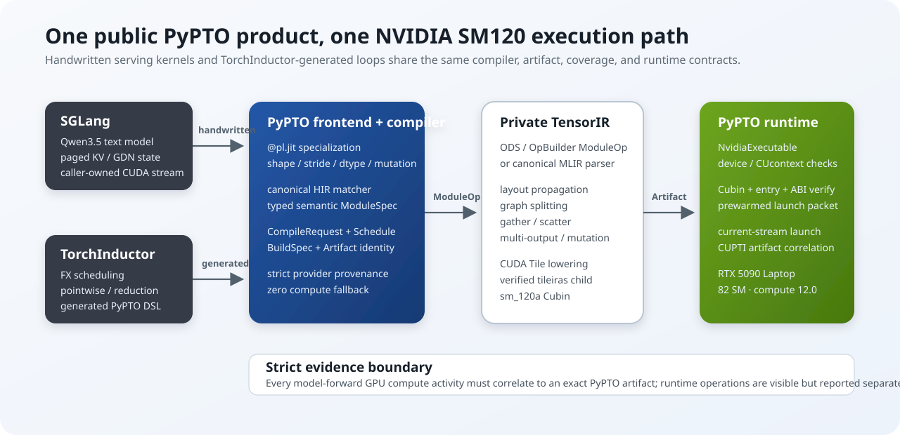
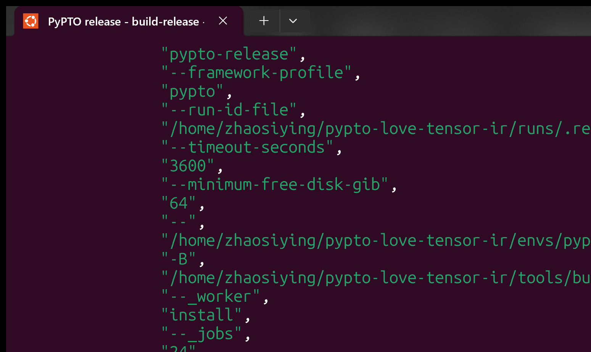
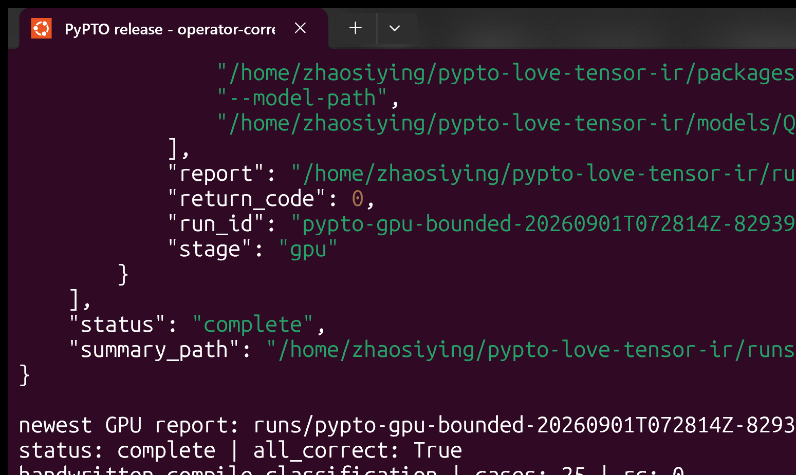
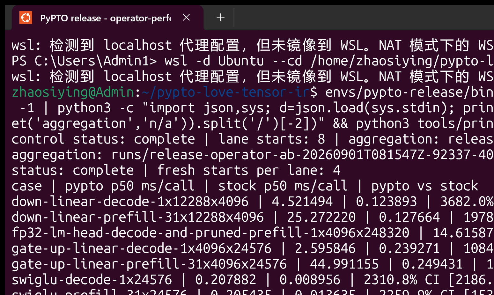
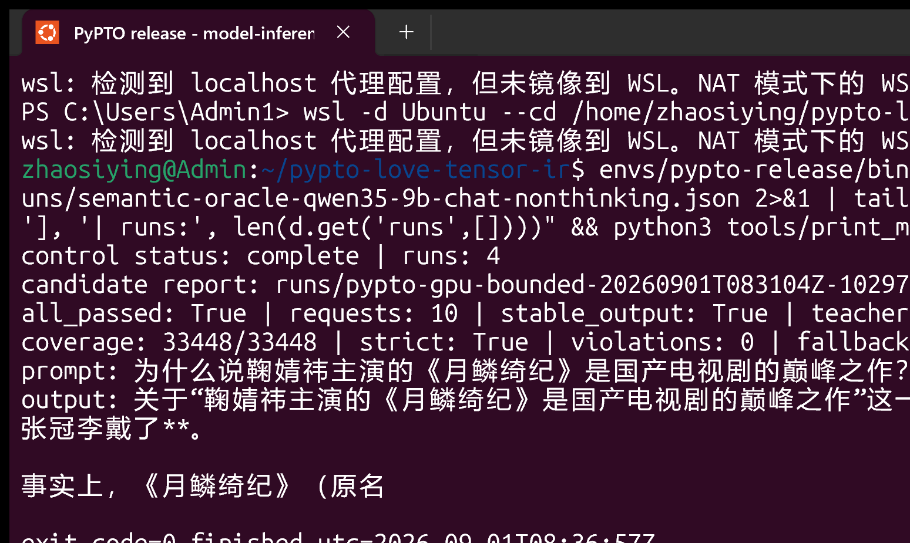

# PyPTO ♥ TensorIR: Qwen3.5 Inference with 100% PyPTO Kernels on an NVIDIA RTX 5090

[简体中文](README.md) | [English](README_EN.md)

> [!IMPORTANT]
> This repository is a **personal, non-profit** compiler research project. Running
> PyPTO on NVIDIA GPUs appears, on its face, to conflict with the CANN Open
> Software License Agreement Version 2.0, which restricts use and distribution to
> systems with Huawei AI processors; personal research and non-profit intent are
> not license exemptions. The motivation aligns with the vision expressed by
> Dr. Liao Heng, Huawei Chief Scientist, at approximately 2h34m of an interview
> with Zhang Xiaojun: that PyPTO should become a common frontend DSL for **all**
> AI chips. That public statement is not a license change and not authorization
> for this project. Rights holders who believe any content is inappropriate may
> contact the author via repository Issues for removal. Full analysis in
> [LEGAL_NOTICE.md](LEGAL_NOTICE.md).
> Interview: <https://www.bilibili.com/video/BV1nB3u6tERu/?vd_source=f2f41aa7b5e3cc8e0a23942779ccea11>

## What this is

A compiler implementation that brings [PyPTO](https://github.com/hw-native-sys/pypto)
(the kernel DSL frontend of the Huawei CANN ecosystem — its positioning is
analogous to Triton in the Ascend stack) to NVIDIA GPUs: **on an RTX 5090
(SM120), every GPU kernel in the Qwen3.5-9B inference forward pass is expressed
in the PyPTO frontend and produced by this repository's compilation pipeline**.
A per-kernel CUPTI audit measures 100% coverage (zero fallback), and outputs
match the native SGLang implementation token for token.

Two core features:

1. **PyPTO → TensorIR bridge**: statically specialized PyPTO HIR (`@pl.jit`
   tile graphs) is lowered through typed TensorIR (MLIR ODS/OpBuilder) →
   CUDA Tile → `tileiras` into an `sm_120a` cubin, packaged as a validated,
   cacheable `NvidiaExecutable` launched on the caller's CUDA stream.
   The PyPTO fork carries 300 commits; the TensorIR fork carries 89
   (row gather/scatter layouts, multi-output fusion, a runtime-free artifact
   contract, and more).
2. **A PyPTO backend for TorchInductor**: standard
   `torch.compile(model, backend="pypto")`. It reuses the full official
   `compile_fx` and auto-generates fusible pointwise / trailing-axis-reduction
   subgraphs as PyPTO DSL kernels; unsupported cases fail closed and never
   silently fall back to Triton.

```text
SGLang (unpatched)
  └─ pypto-kernels (handwritten operators) + TorchDynamo/TorchInductor (PyPTO backend)
       └─ PyPTO HIR → typed TensorIR ModuleOp → CUDA Tile → tileiras → sm_120a Cubin
            └─ PyPTO Artifact / NvidiaExecutable → caller-owned CUDA stream
```



On top of this, `packages/pypto-kernels` is a framework-independent handwritten
PyPTO operator library (13 modules / 21 `@pl.jit` graphs) covering every
operator of Qwen3.5's hybrid-attention topology (24 GDN layers + 8 full
attention layers): attention, GDN, RoPE, RMSNorm, causal conv, linear
projections, embedding, LM head; the MLP activation is auto-fused by the
Inductor backend. SGLang integrates through its official plugin mechanism —
**zero patches to SGLang itself**.

## Measured results (RTX 5090 Laptop 24 GiB; evidence frozen 2026-09)

| Item | Result |
|---|---|
| Qwen3.5-9B correctness | PASS: 3 fresh starts × 10 requests × 64 tokens, **token-identical** to native SGLang (unique output-sequence SHA-256) |
| model-forward PyPTO coverage | **100%**: 33,448 compute calls = 31,400 handwritten + 2,048 Inductor-generated, 0 fallback |
| Operator regression | PASS: 8 suites / 101 cases (re-run on hardware 2026-09-01) |
| End-to-end throughput | PyPTO **2.3393 tok/s**; SGLang matched **14.9754**; SGLang optimized **12.5000** |
| Relative performance | **PyPTO = 15.62% of matched** (95% CI [15.59%, 15.70%]); **18.71% of optimized** (CI [18.69%, 18.75%]) |
| Bottleneck attribution | CUPTI/NVTX reconciliation closes: the gap is dominated by unoptimized structured matmul (6–195×), not by the bridge itself |

| Metric (p50) | PyPTO | matched | optimized |
|---|---:|---:|---:|
| E2E | 27358.76 ms | 4273.67 ms | 5119.99 ms |
| TTFT | 3343.10 ms | 73.21 ms | 151.39 ms |
| TPOT | 381.23 ms | 66.66 ms | 78.86 ms |
| Output throughput | 2.3393 tok/s | 14.9754 tok/s | 12.5000 tok/s |
| Peak GPU memory | 17.49 GiB | 18.09 GiB | 22.08 GiB |

Lanes: **PyPTO** (all operators via PyPTO; CUDA graphs/overlap off);
**matched** (SGLang default operators with configuration aligned to the PyPTO
lane: `mem_fraction_static=0.78, cpu_offload_gb=2`, CUDA graphs/overlap off);
**optimized** (official SGLang defaults with CUDA graphs/overlap on).
Workload: chat-template 31 input tokens + greedy 64 output tokens, BF16, TP1,
concurrency 1; 4 fresh process starts per lane; the headline is the median of
per-start p50s with a 10,000-resample percentile bootstrap CI. Machine-readable
results: `state/evidence/qwen35-9b-release-results-current.json`.

**Four live-run screenshots** (real execution of `wsl -d Ubuntu` inside
PowerShell; sidecar JSONs record the command and PNG SHA-256 — see
[Screenshot reproduction](#screenshot-reproduction)):

| Stage | Command | Screenshot |
|---|---|---|
| Build (wheels→native→CTest→install, `status: complete`) | `tools/build_release.py --stage all` |  |
| Operator correctness (8 suites, 101 cases, `all_correct: true`) | `tools/run_operator_regression.py --stage all` |  |
| Operator performance A/B (PyPTO vs SGLang stock, 4+4 fresh starts) | `tools/run_operator_performance.py --matrix` |  |
| End-to-end inference (fixed prompt, 64-token greedy + per-token gate) | `tools/run_model_correctness.py all` |  |

## Environment requirements

| Component | Version (pinned) |
|---|---|
| GPU | NVIDIA RTX 5090 (SM120 / compute capability 12.0, 24 GiB) |
| OS | Ubuntu 26.04 (WSL2 works; all measurements were taken on WSL2) |
| CUDA toolkit | 13.3 (ships the `tileiras` assembler; verified by path + SHA-256 + version before build) |
| Python | CPython 3.14.6 |
| PyTorch | 2.13.0+cu130 |
| SGLang | 0.5.18 (`71de97b`, unmodified) |
| Build | CMake 3.31, Ninja, C++ toolchain (`--jobs 24` is contractual) |

Python dependencies are lock-driven with full hashes:
`environment/conda-linux-64.lock`, `environment/python-requirements.lock`;
runtime lock: `environment/release-runtime.json`. Source identity is pinned by
`vendor/source-lock.json` + git bundles + 391 patches.

## Quick start

Run from the repository root; steps 1–4 are one-time.

```bash
# 0. (optional) Verify the three upstream trees match bundles+patches byte-for-byte
python3 tools/verify_source_release.py --replay-patches

# 1. Materialize upstream trees: .sources/{pypto,tensor-ir,sglang} from vendor bundles
python3 tools/bootstrap_release.py --jobs 24

# 2. Create the formal release environment envs/pypto-release (lock-driven)
python3 tools/bootstrap_release_environment.py

# 3. Four-stage build: wheels → native (CMake/Ninja with TensorIR as a private subproject)
#    → CTest (13/13) → install
envs/pypto-release/bin/python tools/build_release.py --stage all --jobs 24

# 4. Download models (Qwen3.5-0.8B / 9B → models/, SHA-256 checked against the manifest)
envs/pypto-release/bin/python tools/download_release_models.py --model all
```

The build produces three wheels (`pypto`, `pypto-kernels`, `pypto-framework-plugins`)
installed into the release environment; raw logs and wheel manifests land in
`runs/<run-id>/`.

## Operator correctness regression (checked-in regression test)

```bash
envs/pypto-release/bin/python tools/run_operator_regression.py --stage all
```

Structure gate (`pytest -n24` static contract checks) + 8 GPU suites / 101
cases: compile classification, numerical correctness, stateful operators at
real model shapes (multi-token GDN/conv), paged attention, QK-norm+RoPE,
linear/LM head, CUDA-graph lifecycle, and Inductor SwiGLU. Pass criteria: all
suites `passed: true` and `all_correct: true` (re-run and passed on hardware
2026-09-01; report at `runs/<run-id>/operator-numerical-regression.json`).

## Performance regression (performance-only, includes baseline comparison; checked in)

```bash
# ① Operator-level A/B: 7 aligned operators, PyPTO vs SGLang stock, 4+4 fresh starts
envs/pypto-release/bin/python tools/run_operator_performance.py --matrix --model-path models/Qwen3.5-9B

# ② Whole-model three-lane matrix: pypto / sglang-matched / sglang-optimized, 3×4 fresh starts
envs/pypto-release/bin/python tools/run_performance_regression.py --matrix \
    --model-path models/Qwen3.5-9B --optimized-memory-mode matched

# ③ SwiGLU fusion ablation: eager vs official Inductor (CUDA/Triton) vs PyPTO backend
envs/pypto-release/bin/python tools/run_inductor_ablation.py --mode pypto --phase prefill \
    --output runs/ablation-prefill-pypto.json
envs/pypto-release/bin/python tools/summarize_inductor_ablation.py \
    --prefill-eager runs/ablation-prefill-eager.json \
    --prefill-inductor-nv runs/ablation-prefill-nv.json \
    --prefill-pypto runs/ablation-prefill-pypto.json \
    --decode-eager runs/ablation-decode-eager.json \
    --decode-inductor-nv runs/ablation-decode-nv.json \
    --decode-pypto runs/ablation-decode-pypto.json \
    --output state/evidence/qwen35-9b-inductor-ablation-current.json
```

Timing uses CUDA events; each case runs 20 warmups + 30 batches × 100 calls.
The formal frozen results live in
`state/evidence/qwen35-9b-operator-performance-breakdown-current.json` and
`qwen35-9b-inductor-ablation-current.json`. After a re-run,
`python3 tools/print_operator_ab_table.py` prints the newest per-operator
comparison table from the latest aggregation.

## End-to-end inference: 100% PyPTO Qwen3.5-9B (fixed-prompt reproduction)

```bash
# ① One-time: generate the HuggingFace transformers semantic oracle (first-step logits top-k)
envs/pypto-release/bin/python tools/run_transformers_semantic_oracle.py \
    --model-path models/Qwen3.5-9B --device cuda \
    --output runs/semantic-oracle-qwen35-9b-chat-nonthinking.json

# ② End-to-end correctness: stock reference + 3 fresh candidate starts,
#    per-token ID gate + coverage audit
envs/pypto-release/bin/python tools/run_model_correctness.py all \
    --model-path models/Qwen3.5-9B \
    --semantic-oracle runs/semantic-oracle-qwen35-9b-chat-nonthinking.json
```

Fixed prompt (chat template, non-thinking; 31 input tokens, greedy 64 output):

```text
为什么说鞠婧祎主演的《月鳞绮纪》是国产电视剧的巅峰之作？
```

Expected output (within the 64-token cap, token-identical to native SGLang):

```text
关于“鞠婧祎主演的《月鳞绮纪》是国产电视剧的巅峰之作”这一说法，**目前并不存在客观依据，
这很可能是一个网络误传、营销号夸大其词，或者是将其他作品的评价张冠李戴了**。

事实上，《月鳞绮纪》（原名
```

Pass criteria: all 30 requests token-identical (unique output-sequence SHA-256),
teacher-forced frozen-logits policy passes, and CUPTI coverage 33,448/33,448
with 0 fallback. After a re-run, `python3 tools/print_model_gate_live.py`
prints the latest run's pass status, coverage audit, and generated output.

## Repository layout

```text
packages/pypto-kernels/            # handwritten PyPTO operator library (13 modules / 21 graphs)
packages/pypto-framework-plugins/  # torch.compile(backend="pypto") backend + SGLang plugin
.sources/pypto                     # PyPTO fork (+300 commits: NVIDIA target, compile contracts, runtime)
.sources/tensor-ir                 # TensorIR fork (+89 commits: gather/scatter layouts, artifact contract)
.sources/sglang                    # SGLang v0.5.18 (unmodified)
vendor/                            # source identity locks: git bundles, 391 patches, source-lock.json
tools/                             # all entry scripts: build / correctness / performance / inference
benchmarks/release/                # lanes, workload, operator manifests (frozen test contracts)
state/evidence/                    # frozen measurement-evidence JSONs
models/ tests/ demo/ docs/         # models / harness tests / article-demo corpus / figures & screenshots
envs/ builds/ runs/ caches/        # environments / build artifacts / raw run outputs (gitignored)
```

## Implementation summary

**PyPTO side** (`.sources/pypto`): NVIDIA target identity and SM120 traits; an
immutable `CompileRequest v1` whose `ToolchainIdentity` hashes the
pypto/tensor-ir/cuda-tile/LLVM/CUDA-toolkit/tileiras revisions; a
`CanonicalSchedule`/`KernelBuildSpec` pipeline behind the strict deterministic
facade `compile_structured_strict[_cached]` (canonical MessagePack — identical
inputs produce identical artifacts); `codegen/nvidia/tensor_ir_codegen.cpp`
analyzes the strict HIR subset into a deterministic TensorIrModule, and
`typed_tensor_ir_module_spec.h` + `compiler/nvidia_typed_tensor_ir_builder.cpp`
build a typed `mlir::ModuleOp` via ODS/OpBuilder (no string-built IR — enforced
by lint); the serializable `Artifact v1` (cubin + full kernel ABI) with an
in-process cache; a driver-only runtime `NvidiaExecutable` (dlopens `libcuda`
only, `PrepareLaunch` builds an immutable launch packet fired on the caller's
stream, with a CUDA-graph lease); `tileiras` verified by path/SHA/version then
run in a restricted subprocess; JIT specialization preserves per-element
strides (row-pitched layouts, zero-stride broadcasts).

**TensorIR side** (`.sources/tensor-ir`): row gather/scatter layout lowering
(required by paged KV, embedding, and the GDN state pool); lazy input loads
with one-shot layout conversion; compatible multi-output fusion; residual
graph-splitting fixes; the runtime-free
`CudaTilePreparedArtifact/CompiledArtifact` contract with CUDA-free cubin
validation; `tileiras` subprocess hardening (closed stdio, explicit timeout,
scratch quotas); plus lowering-correctness work (unit-dim matmul, reduction
slicing, zero-stride broadcast, and more).

**Inductor backend** (`packages/pypto-framework-plugins`): an entry-point
`pypto` backend that internally runs the full official `compile_fx`
(`cuda_backend="pypto"`, `implicit_fallbacks=False`, strict Dynamo failures);
reversibly swaps the Inductor CUDA scheduler and wrapper (restores Triton
outside the context) and pins the Triton hash out of cache identity; accepts
only Pointwise and trailing-axis Reduction nodes (everything else raises
`StrictCoverageError`); replays pointwise bodies through an ops recorder and
**emits literal `@pl.jit` DSL source**, specializes with stride-exact meta
tensors, and compiles via `compile_structured_strict_cached`; the generated
wrapper calls a single `pypto_launch(...)` that validates the ABI and launches
on the caller's stream; CUPTI coverage-audit tooling ships with the package.

**Handwritten operator library** (`packages/pypto-kernels`): one operator =
one `@pl.jit` graph; shape/stride ABI validation before every launch; shares
the same compilation path as the Inductor backend. Inventory: attention
(dense/masked/paged-decode/paged-prefill/KV-write/gather — 7 graphs), GDN
recurrent (L2 norm + softplus decay gating + rank-1 state update + output
projection over an `pl.InOut` state pool), packed GDN projection, width-4
causal conv, QK RMSNorm + partial RoPE + gate split, BF16 linear projections,
FP32 LM head, embedding/token-id gather, three RMSNorm variants, NeoX RoPE,
sigmoid gating, and SwiGLU.

**SGLang integration** (zero patches): the official plugin registry wraps
~20 internal call sites via AROUND hooks, dispatching to `pypto-kernels`
operators; registers `--attention-backend pypto` and the GDN backend;
registration failure raises `SystemExit` (SGLang's loader swallows exceptions).

## Performance details and attribution

**Operator-level A/B** (PyPTO p50 / stock p50, ms/call):

| Operator (shape) | PyPTO | stock | Multiple |
|---|---:|---:|---:|
| SwiGLU decode 1×24576 | 0.2035 | 0.0094 | 21.7× |
| SwiGLU prefill 31×24576 | 0.2030 | 0.0091 | 22.2× |
| gate/up linear decode 1×4096×24576 | 2.5967 | 0.2389 | 10.9× |
| gate/up linear prefill 31×4096×24576 | 45.0186 | 0.2512 | 179.2× |
| down linear decode 1×12288×4096 | 4.5270 | 0.1228 | 36.9× |
| down linear prefill 31×12288×4096 | 25.2897 | 0.1299 | 194.7× |
| FP32 LM head 1×4096×248320 | 14.5464 | 2.4238 | 6.0× |

**SwiGLU fusion ablation** (warm call ms / cold compile ms / kernel count /
vs eager):

| Shape · mode | Warm call | Cold compile | Kernels | vs eager |
|---|---:|---:|---:|---:|
| prefill 19×24576 · eager | 0.042966 | 35.3 | 6 | — |
| prefill · official Inductor (Triton) | 0.032915 | 1098.3 | 1 | +30.5% |
| prefill · PyPTO backend | 0.210618 | 1696.2 | 1 | −79.6% |
| decode 1×24576 · eager | 0.040543 | 32.8 | 6 | — |
| decode · official Inductor (Triton) | 0.033808 | 1045.9 | 1 | +19.9% |
| decode · PyPTO backend | 0.212401 | 1733.3 | 1 | −80.9% |

**CUPTI logical-phase attribution** (p50 ms/request): total PyPTO forward
compute 22318.81, of which the unattributed bucket (handwritten linears)
20184.08, attention core+gate 1154.36, LM head 931.87; matched 1285.79;
optimized 2131.56. Of the 22238.77 ms E2E gap versus optimized, 20187.25 ms is
profiled compute plus a 2051.52 ms non-profiled residual; the independent
phase-median reconciliation residual is −9.11 ms (closed).

**Conclusion**: the 15.62%/18.71% end-to-end gap is dominated by structured
matmul without tensor-core pipelines or tile autotuning (6–195×, worst in
prefill shapes), followed by GDN token-ordered launches and decode launch
density; the fusion machinery itself matches the official Triton backend
(6→1 kernels, −83.33% launches). Exact figures live in the corresponding
`state/evidence/` JSONs.

## Screenshot reproduction

The four screenshots are live captures produced by
`tools/windows/capture_powershell.ps1` in Windows Terminal (Ubuntu purple
profile): a nested PowerShell prompt runs `wsl -d Ubuntu`, the real Ubuntu
prompt runs the command, and `PrintWindow` captures the frame on completion.
From PowerShell:

```powershell
$Repo = "\\wsl.localhost\Ubuntu\home\<user>\pypto-love-tensor-ir"
& "$Repo\tools\windows\capture_powershell.ps1" -Title "build-release" `
  -LinuxCommand "envs/pypto-release/bin/python tools/build_release.py --stage all --jobs 24 2>&1 | tail -1 | python3 -m json.tool" `
  -OutputPath "$Repo\docs\assets\screenshots\build-release.png" `
  -MetadataPath "$Repo\state\evidence\build-release-capture-current.json" `
  -Workspace "/home/<user>/pypto-love-tensor-ir"
```

Each capture writes a sidecar JSON (command, exit code, window size, PNG
SHA-256, non-blank pixel samples); the binding manifest is regenerated with
`python3 tools/generate_article_screenshot_manifest.py`.

## Limitations and licensing

- Structured matmul lacks deep optimization (no tensor-core pipeline /
  autotune) — the dominant source of the current performance gap;
- The Inductor backend fuses pointwise/trailing-axis reductions only;
  GEMM+epilogue and cross-node fusion are fail-closed TODOs;
- Long GDN prefills launch token-by-token in order (numerical state-boundary
  contract) rather than as a batched recurrent graph;
- Every kernel is statically specialized per shape/stride; new shapes compile
  once (artifacts persist on disk and are reused);
- Licensing: the PyPTO/CANN license does not permit running on or
  redistributing to non-Huawei processors (see the IMPORTANT note above and
  [LEGAL_NOTICE.md](LEGAL_NOTICE.md)); TensorIR is Apache-2.0 with LLVM
  exceptions; `pypto-framework-plugins` is Apache-2.0; `pypto-kernels` does
  not yet declare an independent license.
