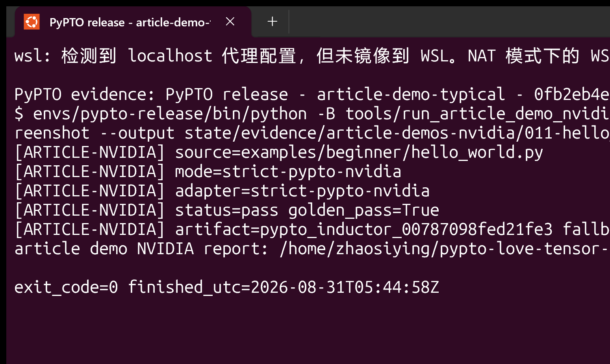

# Demo 目录

[English](README_EN.md)

`pypto-lib/` 是微信文章
[让 Python 写 NPU 算子所写即所得！华为昇腾开源 PyPTO-Lib，实现 Qwen3-14B 与 DeepSeek V4-Flash 全部算子！](https://mp.weixin.qq.com/s/7tLlTbomH9OqyUbZDbBEhQ)
在文章时点的 byte-for-byte 源码快照。不要编辑 `demo/pypto-lib/` 内的导入文件。
`SOURCE_MANIFEST.json` 锁定 151 个文件和 66 个入口；策略文件另外记录每个
入口是否依赖硬件 API。

## NVIDIA 计算类闭环

先生成并校验外部策略，再运行全量矩阵：

~~~bash
python3 tools/classify_article_demos.py
envs/pypto-release/bin/python tools/run_article_demo_matrix.py \
  --backend nvidia --mode run --device 0 \
  --output state/evidence/article-demo-matrix-nvidia-current.json
~~~

当前真机结果为 10/10 个教学计算入口通过（9 个独立 CUDA 数值参考，
`hello_world.py` 额外通过严格 PyPTO -> TensorIR -> CUDA Tile artifact），
`allreduce.py` 因分布式通信 API 跳过。矩阵保留 17 个硬件 API 跳过、8 个
draft，以及 31 个尚无有界 NVIDIA adapter 的模型计算入口；这些条目不会被
计入“严格 NVIDIA 编译通过”。报告中的 `compatibility_status` 和每条
`hardware_api_evidence` 是发布判断依据。

典型严格入口：

~~~bash
envs/pypto-release/bin/python tools/run_article_demo_nvidia.py \
  --demo examples/beginner/hello_world.py --device 0 \
  --run-id article-demo-nvidia-hello-screenshot \
  --output state/evidence/article-demos-nvidia/011-hello_world-screenshot.json
~~~

终端会显示 `strict-pypto-nvidia`、`golden_pass=True`、artifact 名称和
`fallback_used=False`；当前真机 `y` 的 `max_abs_diff=0.0`。其报告绑定导入源 SHA、策略 SHA、编译 artifact/cubin
SHA 和 128-element tile；输入源码仍保持不变。

其他 9 个教学入口使用独立 CUDA Torch 参考实现验证数学结果，报告明确写入
`strict_compiler_evidence=false`，不能替代严格 PyPTO 编译证据。这一分层是
为了让读者可以在 NVIDIA 上学习计算语义，同时不把 Ascend orchestration 或
CPU/golden-only 结果误报成后端支持。

## 原始 Ascend 命令与审计

如需复现文章原始 CLI/help 或在具备授权 Ascend runtime 的机器上运行未改写
源码，使用原始 launcher：

~~~bash
envs/pypto-release/bin/python tools/run_article_demo_matrix.py \
  --backend ascend --mode help --output runs/article-demo-matrix-help.json
envs/pypto-release/bin/python tools/run_article_demo.py \
  --demo examples/beginner/hello_world.py --platform a2a3sim \
  --output runs/article-demo-hello-world.json
~~~

`--backend ascend` 只执行文章原命令；当前环境缺少 Ascend
`simpler_setup`，所以设备失败会记录 blocker。硬件通信、CCE kernel、NPU/ACL
和 simpler runtime 入口在 NVIDIA 矩阵中明确跳过，不伪造精度结果。

## 典型截图

严格 `hello_world` 已在真实 Windows Terminal 的 Ubuntu/PowerShell 紫色窗口中
运行并截图；同一次命令、run ID、报告 SHA 和可见的 golden 结果由
[`article-demo-screenshot-manifest-current.json`](../state/evidence/article-demo-screenshot-manifest-current.json)
绑定。窗口为 1549×925，`PrintWindow` visible samples 为 5184/5335，命令
`exit_code=0`，`y.max_abs_diff=0.0`。此前的黑屏尝试未被采用。

