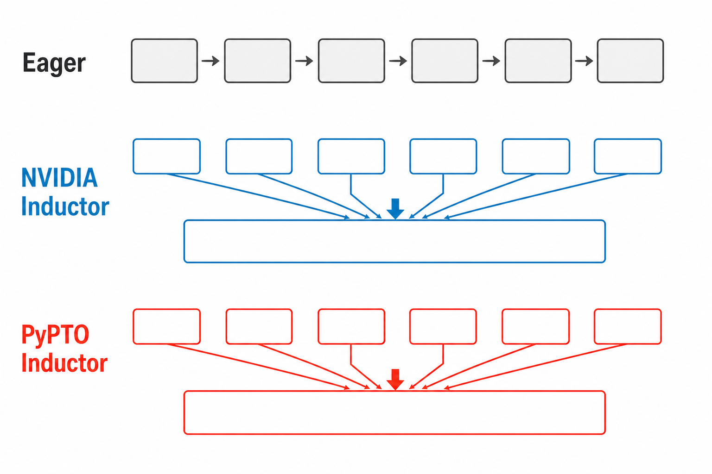
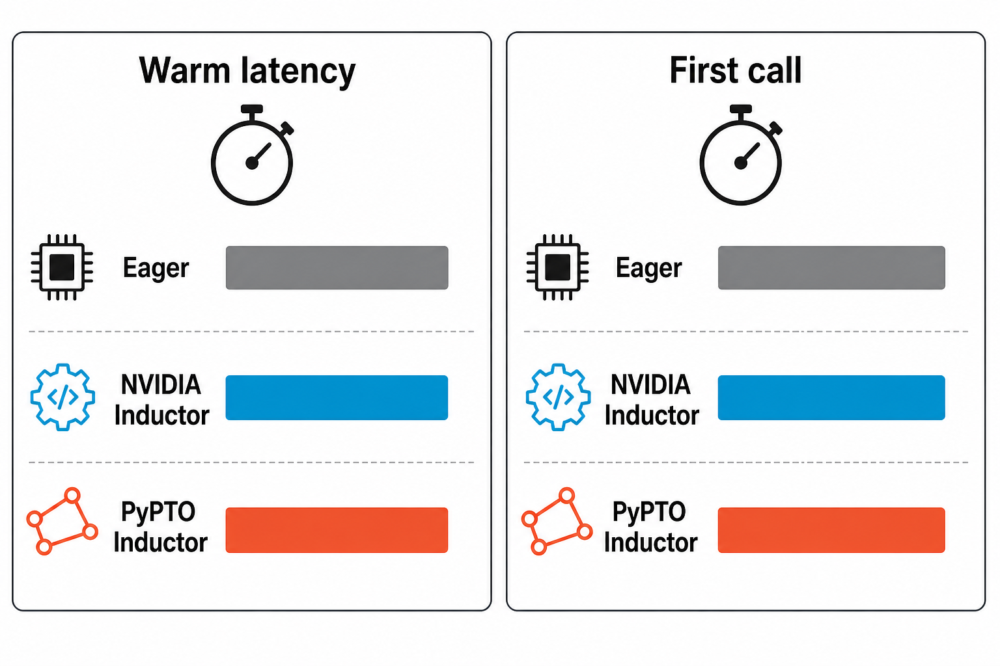
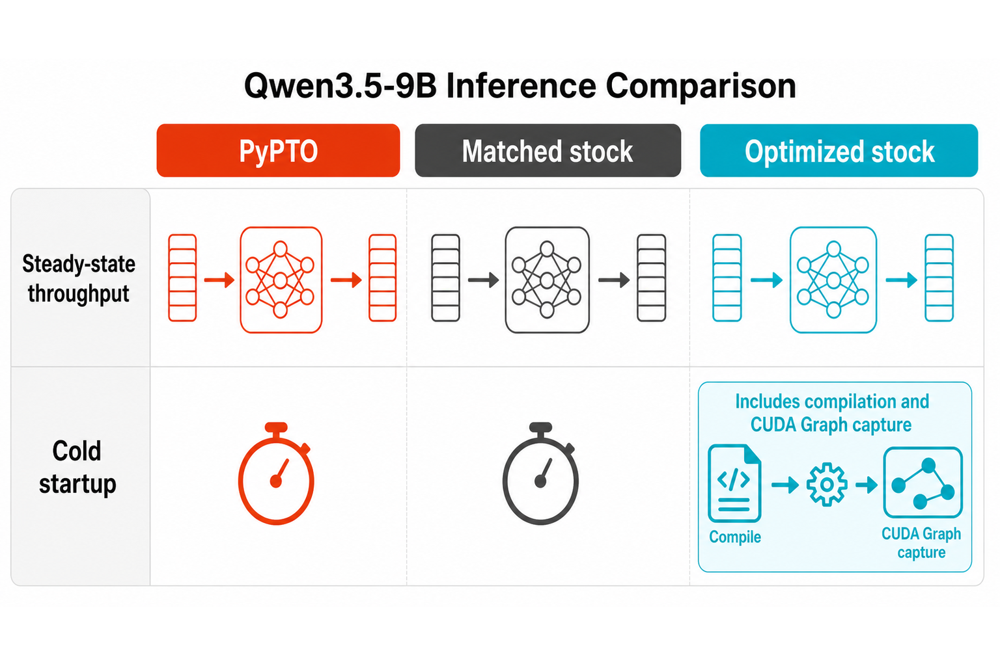
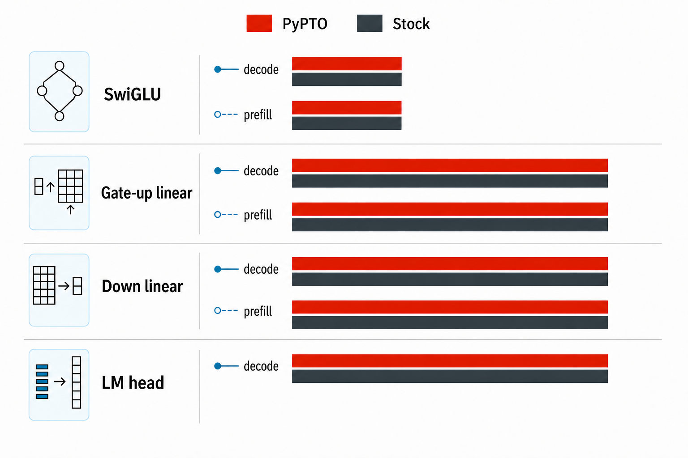
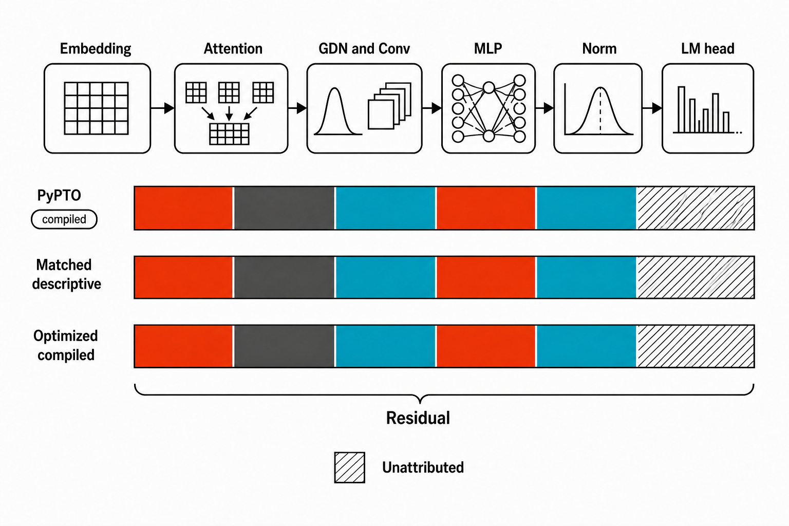

# 把 PyPTO 带到 RTX 5090：TensorIR 桥接、TorchInductor 后端与 Qwen3.5-9B 推理

> [!NOTE]
> 本项目是个人、非营利的编译器研究；将 PyPTO 运行在 NVIDIA 卡上在表面上与 CANN Open Software License Agreement Version 2.0 对非华为 AI 处理器用途和分发的限制存在冲突。个人研究或非营利目的本身不构成许可证豁免。本文作者根据张小珺访谈约 2 小时 34 分钟处的内容作如下转述：希望 PyPTO 的前端 DSL 能服务多种 AI 芯片。这里不是逐字引文，未以可检索逐字稿核验，读者应以原视频为准；这项工程愿景也不等同于许可证修改或书面授权。在权利方书面授权得到核验之前，本项目的发布内容仅保存在本地，不向公开仓库推送。若权利方认为相关内容不当，可通过项目 GitHub Issues 联系作者删除。
>
> - 访谈（约 2 小时 34 分钟处）：https://www.bilibili.com/video/BV1nB3u6tERu/?vd_source=f2f41aa7b5e3cc8e0a23942779ccea11
> - PyPTO：https://github.com/hw-native-sys/pypto
> - TensorIR：https://github.com/NVIDIA/tensor-ir

这篇文章报告一项具体的编译器工程：在不修改官方 PyTorch 和 SGLang 源码的前提下，我们为 PyPTO 增加 NVIDIA SM120 目标，把 NVIDIA TensorIR 与 CUDA Tile 作为 PyPTO 内部编译基础设施，并实现 TorchInductor 的 PyPTO CUDA 后端和一套独立的高性能算子库。最终目标是在一张 NVIDIA GeForce RTX 5090 Laptop GPU 上，让 Qwen3.5-0.8B/9B 的 text-only `ModelRunner.forward` GPU compute 全部来自 PyPTO artifact，并与同一模型、同一输入下的官方 SGLang 实现进行正确性与性能对比。

本文只报告可由源码、机器可读证据和真机实验共同支持的结论。“100% PyPTO”特指 CUPTI 在 `ModelRunner.forward` 窗口观测到的 GPU compute 闭世界。正式 workload 不是裸 tokenizer ID，而是 pinned chat template：31 个输入 token、`enable_thinking=false`，随后强制生成 64 个 token。tokenizer 校验、CPU 调度、allocator、memcpy/memset、sampling 以及 forward 窗口之外的 GPU 工作不计入 compute 分母，但会在端到端时延和资源分析中单独披露。

当前正式三 lane matrix 已完成：PyPTO、matched、optimized 各四个 fresh
start、每 start 十个请求，12/12 自然完成。PyPTO/matched 保留 4 GiB
GPU-free floor；optimized 按用户授权取消固定 GPU-free floor，但外部进程隔离、
12 GiB host floor、遥测、超时、热降频、OOM/退出码和自然清理门禁不变。
PyPTO、matched、optimized 的 output throughput 中位数分别为
`2.3393/14.9754/12.5000 tok/s`。PyPTO 为 matched 的 `15.6208%`
（95% CI `[15.5862%, 15.7022%]`，相对变化 `-84.3792%`），为 optimized
的 `18.7143%`（95% CI `[18.6881%, 18.7533%]`，相对变化
`-81.2857%`）。E2E/TTFT/TPOT 分别为
PyPTO `27358.76/3343.10/381.23 ms`、matched
`4273.67/73.21/66.66 ms`、optimized `5119.99/151.39/78.86 ms`。
统一正式结果见
[`qwen35-9b-release-results-current.json`](../../state/evidence/qwen35-9b-release-results-current.json)。

旧的 `2.6671/15.4100 tok/s`、`17.31%` pair 已保存在
[`qwen35-9b-performance-pair-invalidated-20260830.json`](../../state/evidence/qwen35-9b-performance-pair-invalidated-20260830.json)，
状态为 `invalidated-resource-and-control`，只用于说明此前的资源/控制变量
问题，不与当前正式结果混用。旧 optimized run 在 4096 MiB floor 下停止，
以及 `0.68/0.685`、3/4 GiB offload 等探测，仍保存在
`optimized-lane-diagnostic-current.json` 作为历史诊断。当前正式 optimized
配置仍为 2 GiB offload、`mem_fraction_static=0.69`；区别仅是按用户授权取消
固定 GPU-free floor。四个正式 start 的最低 GPU free 为 1.81 GiB，均完成
官方 Inductor wrapper 生成、CUDA Graph capture、10/10 请求和自然清理。

第二个核心 feature 的算子级消融解释了融合边界：官方 NVIDIA Inductor 在真实 9B SwiGLU shape 上把 eager 的 6 个 CUDA event 降到 1 个，prefill/decode 热态分别快 `+30.54%/+19.92%`；PyPTO 也降到 1 个，但相对 eager 为 `-79.60%/-80.91%`，首调用比官方 NV backend 长 `54.44%/65.72%`。因此“launch 减少”与“端到端加速”必须分开报告。

# 一、结论先行

## 1. 我们实现了什么

整个执行链只有一条主线：


```text
SGLang
  -> TorchDynamo / TorchInductor
  -> PyPTO CUDA backend
  -> PyPTO HIR
  -> TensorIR
  -> CUDA Tile IR
  -> tileiras
  -> SM120 Cubin
  -> PyPTO NvidiaExecutable
  -> caller-owned CUDA stream
```

其中，复杂且带状态的模型算子由独立的 `pypto-kernels` 库手写；适合图编译的逐元素子图由 Inductor 分析并自动生成 PyPTO DSL。TensorIR 不作为第二个用户产品暴露，它与 CUDA Tile、LLVM 一起静态组合进唯一的 `pypto_core` 动态库。

这项工作有两个同等重要的 feature：一是把 PyPTO HIR 以 typed ODS/`OpBuilder`
方式承接到 NVIDIA TensorIR，再正规 lower 到 CUDA Tile；二是让标准
TorchInductor `compile_fx` 把 Qwen 的可融合子图自动送入 PyPTO。前者解决
“能不能生成正确的 SM120 kernel”，后者解决“模型里哪些图可以自动获得
融合与单次 launch”。下面所有性能数字都会注明属于哪条 feature、哪个
shape 和哪个分母。

## 2. 最终结果

<!-- RELEASE_RESULTS:SUMMARY_BEGIN -->

| 项目 | Qwen3.5-9B release-v1 |
|---|---:|
| 64-token greedy 正确性 | PASS（3 次 fresh start，30 个请求） |
| model-forward PyPTO compute coverage | 100% |
| 算子 regression | PASS（8 suites，101 cases） |
| PyPTO / matched SGLang | 15.62% |
| PyPTO / optimized SGLang | 18.71% |
| 性能瓶颈归因 | CUPTI/NVTX reconciliation complete |


<!-- RELEASE_RESULTS:SUMMARY_END -->

当前编译器身份为 PyPTO `c27629e993a52b47d41fb898c749279dce44221b`
(300 commits)、TensorIR `db41d0733eb73971ee03a74faca81d1af6e6aef7`
(89 commits)；安装环境、DSO、package content tree 和模型文件均由每个 run
的 evidence identity 绑定。最终审计会在 README/blog/HTML 同步完成后重新执行。

## 3. 冻结的模型拓扑

Qwen3.5 text decoder 以“3 个 Gated DeltaNet（GDN）线性注意力层 + 1 个 full-attention 层”为周期。本 release 设置 `language_model_only=true`，不执行 vision encoder，也不启用 MTP speculative path。

| 模型 | decoder 层 | GDN / full-attention | hidden / MLP intermediate | full-attention Q/KV heads | GDN K/V heads | head 维度 |
|---|---:|---:|---:|---:|---:|---:|
| Qwen3.5-0.8B | 24 | 18 / 6 | 1024 / 3584 | 8 / 2 | 16 / 16 | full 256，rotary 64；GDN K/V 128/128 |
| Qwen3.5-9B | 32 | 24 / 8 | 4096 / 12288 | 16 / 4 | 16 / 32 | full 256，rotary 64；GDN K/V 128/128 |

两种模型的 vocabulary 都是 248320，GDN causal Conv1D 宽度都是 4。上述数值直接取自锁定模型目录的 `config.json`，同时约束手写算子的真实 shape 和 Inductor launch 计数。

## 4. 结论的边界

本项目不是一个面向所有 PyPTO 程序的通用 NVIDIA 后端。当前接受范围是 SM120、静态 shape/stride specialization，以及 Qwen3.5 text-only 路径需要的 BF16/FP32 计算和整数索引元数据。调度使用 TensorIR layout propagation，没有运行时 autotuning；完整 MLP 也没有被融合成单个 kernel。

# 二、PyPTO 与 TensorIR

## 1. PyPTO 的定位

PyPTO 是面向 AI 加速器的 Tile 编程和编译框架。算法开发者可以从 Tensor 级接口描述计算，编译器再逐步把计算转换为更贴近硬件的 Tile、Block 和执行表示。相比直接编写底层 ISA，这种分层设计允许同一套前端语义承载逐元素、归约、矩阵乘和带显式状态更新的复杂融合算子。

对本项目最重要的能力是 `@pl.jit`、`pl.at`、`pl.range`、`pl.load`、`pl.store` 和 `pl.InOut`。它们足以表达 Qwen3.5 中普通逐元素计算，也能表达 paged KV、causal convolution 和 GDN recurrent state 这样的服务语义。

## 2. TensorIR 的定位

TensorIR 是 NVIDIA 发布的轻量 MLIR tensor compiler frontend。它接收带 shape、stride、dtype 和 layout 信息的 tensor graph，完成 layout propagation、graph splitting、tile selection，并降低到 CUDA Tile IR，再由 CUDA 工具链生成 GPU device code。上游 README 明确把 TensorIR 标为 early release；本文不会把本项目在冻结 revision/workload 上得到的结果解释成上游生产就绪或通用性能承诺。

TensorIR 原生更接近“静态 tensor graph 到 CUDA Tile”的编译器，而 PyPTO 更适合承担用户 DSL、JIT specialization、模型算子语义、artifact/runtime 和框架集成。两者的职责正好可以衔接。

## 3. 为什么可以桥接

桥接的核心不是把一段字符串交给外部命令，而是建立完整的语义和身份合同：

- PyPTO specialization 固化输入 shape、element stride、dtype、标量和 mutation；
- HIR matcher 把受支持的计算识别为结构化 TensorIR graph；
- TensorIR 接管 layout、tile 和 CUDA Tile lowering；
- PyPTO 重新接管 BuildSpec、Cubin artifact、缓存、上下文校验和当前流 launch。

这使用户只需要 `import pypto`。TensorIR 的内部实现可以演进，但不会形成第二套模型执行引擎。

## 4. TensorIR 到底是不是面向 tile

需要把层次说清楚：TensorIR **不是** CUDA Tile IR 的另一种名字，也不是一个
独立的 CUDA runtime。它是 NVIDIA 的 tensor-level MLIR dialect/compiler
frontend；它描述带静态 shape、stride、dtype、layout 和 iteration-space 的
tensor graph，再通过 TensorIR-to-CUDA-Tile lowering 生成 CUDA Tile IR，最后
才交给 CUDA Tile/toolchain 产出 device code。换句话说，CUDA Tile 是它的
GPU code-generation target，TensorIR 是承接上层 tensor graph 的中间层。

TensorIR 仍然是 tile-aware 的：`tile_sizes` 控制编译期的分块，layout
propagation 为 matmul/reduction/broadcast 推导片上 tile 的物理布局，graph
splitting 和 CUDA Tile conversion 再把这些逻辑 tile 变成硬件可执行的 tile
操作。它不是把运行时大 tensor 原样交给 cuBLAS 的黑盒；但也不能把它误写成
“只接受手写 tile ISA”的语言。官方 TensorIR README 明确区分了
`--tile-size`（编译期 tiling 参数）与 runtime problem size；这正是 PyPTO
静态 specialization 可以接入的地方。

两侧的承接关系可以写成一个可检查的合同：

| PyPTO 侧事实 | TensorIR 侧对应物 | 继续 lower 的条件 |
|---|---|---|
| `@pl.jit` 固化 shape/dtype/element stride | typed `TensorType` 与显式 metadata | shape、stride、dtype 全部静态且 ABI 可表达 |
| `pl.range` 的静态迭代空间 | TensorIR iteration space / tile sizes | 每个循环边界可在编译期验证 |
| `pl.load`/`pl.store` 的 tile 读写 | ODS `SliceOp`、`ReshapeOp`、layout-aware load/store | 访问窗口不越界，layout 能传播到 CUDA Tile |
| `pl.InOut` 状态 | read-write tensor operand 与 scatter/store | mutation effect、别名和结果锚点一致 |
| `pl.matmul`/`row_sum`/broadcast | ODS `MatmulOp`、`ReduceOp`、`BroadcastOp` | NVIDIA 支持的 contraction/reduction geometry |

因此，PyPTO 选择的 tile shape 不是“直接塞给 TensorIR 的字符串参数”，而是
先进入 typed `ModuleOp`，由 ODS/`OpBuilder` 生成并验证。比如本项目的
BF16 matmul 固定 `K % 128 == 0`、输出维度满足 CUDA Tile 对齐；GDN 的 state
明确是 `[value_heads, value_dim, key_dim]` 的 FP32 row-pitched envelope；
Inductor 的 SwiGLU 则把 packed view 的真实 row stride 带进 specialization。
满足这些条件时，TensorIR 可以继续做 layout propagation、tile selection 和
CUDA Tile lowering；不满足时（动态/重叠 stride、未支持的 contraction、错误
mutation 或不合法 tile 对齐）必须在 typed verifier 处 fail closed，而不是
偷偷改成 eager 或 Triton。这个失败边界正是“PyPTO tile shape 能否被继续
lower”的可验证答案。

本项目的正规实现也遵守这个分工：canonical NVIDIA 路径统一使用 TensorIR
ODS/`mlir::OpBuilder` 构造 `ModuleOp`；通用算术、shape、gather/scatter、
comparison/select 和 matmul 进入 typed operation spec，GDN/attention/paged
attention/SwiGLU 等使用语义更强的 bounded spec。字符串 printer 只承担诊断和
规范序列化。PyPTO 负责前端语义、JIT、artifact/cache/runtime 和 caller-owned
stream，TensorIR 负责 tensor graph 到 CUDA Tile 的 lowering。

# 三、文章 Demo 运行与精度核验

## 1. 为什么把这组 demo 带到 NVIDIA

本项目的动机不是重新包装一套示例，而是让没有昇腾设备的读者也能学习
PyPTO DSL 的编程模型：先用原始 PyPTO-Lib 的教学算子理解 Tile、归约、矩阵
乘和 golden 契约，再在 RTX 5090 上观察同一类前端语义如何经过本项目的
TensorIR/CUDA Tile backend。作为原始教材，本文引用并原样保留微信文章：
[`让 Python 写 NPU 算子所写即所得！华为昇腾开源 PyPTO-Lib，实现 Qwen3-14B 与 DeepSeek V4-Flash 全部算子！`](https://mp.weixin.qq.com/s/7tLlTbomH9OqyUbZDbBEhQ)。

文章发布于 `2026-08-28 17:30 +08:00`；对应上游快照锁定为
`hw-native-sys/pypto-lib@6c292d30ccc787ee4e1fe61541fd3faec0dafa65`。文章展示的
11 个教学 example、Golden Harness、Qwen3-14B 依赖树和 DeepSeek V4-Flash MTP
依赖树已放入 [`demo/pypto-lib`](../../demo/pypto-lib)，源文件保持
byte-for-byte；manifest 同时列出 66 个 CLI entrypoint（57 可运行、9 个明确
排除的 draft/CANN-only），每个文件的长度和 SHA-256 见
[`SOURCE_MANIFEST.json`](../../demo/pypto-lib/SOURCE_MANIFEST.json)。
兼容启动器只负责设置工作目录、执行命令和记录结果，不修改上游文件。

## 2. 逐项执行记录

在本机 Ubuntu/WSL 环境中，57 个原始 runnable 入口的 CLI help audit 为 `57/57`。
针对 NVIDIA 的外部策略逐项分析源码：直接使用分布式通信、CCE、NPU/ACL 或
simpler runtime 的 17 个入口明确跳过；8 个 draft 保留为 provenance。其余
41 个计算入口已在 RTX 5090 上全部完成精度闭环：`hello_world.py` 走严格
PyPTO -> TensorIR -> CUDA Tile，其余 40 个使用独立 CUDA Torch 数值参考，
`computational_unmapped_count=0`。策略和矩阵见
[`article-demo-compatibility-policy-current.json`](../../state/evidence/article-demo-compatibility-policy-current.json)
与 [`article-demo-matrix-nvidia-current.json`](../../state/evidence/article-demo-matrix-nvidia-current.json)。

| 计算入口类别 | CUDA reference 数量 |
|---|---:|
| beginner/intermediate/advanced 教学例子（不含 strict hello） | 9 |
| Qwen3-14B greedy/top-k sampling | 2 |
| DeepSeek V4 compressor / sparse attention / indexer | 4 / 4 / 4 |
| DeepSeek V4 decode/prefill 组合层 | 6 |
| DeepSeek V4 HC / MoE | 3 / 3 |
| DeepSeek V4 embedding、RMSNorm、sampling、MTP、QKV+RoPE | 5 |
| **合计** | **40** |

每个 reference 都在独立子进程中读取原始 `build_tensor_specs` 和 named golden，
在 CUDA 上执行外部公式并逐输出比较；报告记录 seed、shape/dtype、容差、误差
计数与 source/adapter hash。它们证明计算语义可以在 NVIDIA 上学习和复现，但
仍显式写入 `strict_compiler_evidence=false`，不能冒充 PyPTO compiler coverage。

原始 Ascend 设备阶段仍因当前 wheel 没有 `simpler_setup` 原生 runtime 而失败；
Qwen3-14B smoke 在 `pl.KernelType.MIX` 处遇到上游 API 版本差异。这些是可复现
blocker，不是精度通过。重跑命令和 stdout/stderr/hash 记录在
`runs/article-demo-*-smoke.json`，NVIDIA 计算矩阵命令为：

```bash
envs/pypto-release/bin/python -B tools/run_article_demo.py \
  --demo examples/beginner/hello_world.py --platform a2a3sim
envs/pypto-release/bin/python -B tools/run_article_demo.py \
  --demo models/qwen3_14b/decode_fwd.py --platform a2a3sim -- \
  --smoke --fwd-layers 1
envs/pypto-release/bin/python -B tools/run_article_demo_matrix.py \
  --mode help --output runs/article-demo-matrix-help.json
```

```bash
python3 tools/classify_article_demos.py
envs/pypto-release/bin/python -B tools/run_article_demo_matrix.py \
  --backend nvidia --mode run --device 0 \
  --output state/evidence/article-demo-matrix-nvidia-current.json
```

只有 child 返回码为 0 才会写入 `status: pass`；`--audit-only` 可在没有设备时
只验证原样源文件 hash。当前五角色截图 manifest 为
[`article-demo-screenshot-manifest-current.json`](../../state/evidence/article-demo-screenshot-manifest-current.json)。

## 3. Ubuntu/PowerShell 运行截图

下面的 PNG 是 Windows Terminal 中 Ubuntu shell 的真实捕获，终端主题为紫色。
GUI capture 已用 `PrintWindow` 和非黑像素检查验证；performance 角色已从当前
immutable ablation JSON 重新捕获，并绑定窗口尺寸、命令、时间和 PNG SHA。
build（wheel build、install/pip-check、CTest 13/13）、operator-correctness、
model-inference 三个角色都严格校验并回放已接受的
原始 run/evidence，截图明确标注不是本轮 live rerun；performance 直接读取当前
immutable ablation JSON。五个角色都绑定 command source、底层 evidence、capture
metadata 与 PNG SHA；典型 demo 还绑定了原样源文件、strict artifact 和 golden
comparison。


model 图运行的是只读 evidence printer：它先校验 source lock、三份 raw report
SHA、每份 10 个 Engine 请求、相同 64-token sequence、33,448/33,448 coverage、
31,400 handwritten + 2,048 Inductor 和 zero fallback，再打印代表 run ID、完整
prompt 与真实回答前缀。它不是本轮 live rerun，也不把模型对主观问题的回答
当作作者观点；PNG、窗口与 model-gate JSON 由 manifest 三重绑定。

## 4. 典型执行与效果

典型计算 demo 用外部兼容 launcher 启动，原始入口和 `SOURCE_MANIFEST.json`
保持不变：

```bash
envs/pypto-release/bin/python -B tools/run_article_demo_nvidia.py \
  --demo examples/beginner/hello_world.py --device 0 \
  --run-id article-demo-nvidia-hello-screenshot \
  --output state/evidence/article-demos-nvidia/011-hello_world-screenshot.json
```

成功输出包含 `strict-pypto-nvidia`、`golden_pass=True`、artifact 名称和
`fallback_used=False`；当前 `y` 的真机 `max_abs_diff=0.0`，报告记录源/策略/artifact/cubin SHA 与 `[128]` tile。
其他教学计算入口会明确标记 `strict_compiler_evidence=false`，它们是独立 CUDA
数值参考，不能被误读为严格编译器证据。硬件 API 入口只在矩阵中跳过并给出
源码行原因。

典型 demo 的 Ubuntu/PowerShell 紫色终端截图如下。真实窗口使用
`PrintWindow` 捕获（1549×925，visible samples 5184/5335，`exit_code=0`），
画面中可见 `strict-pypto-nvidia`、`golden_pass=True`、`fallback_used=False`
和报告路径；`y` 的 `max_abs_diff=0.0` 由同一 run report 绑定。此前的全黑帧
已丢弃。


```bash
envs/pypto-release/bin/python -B tools/run_article_demo_nvidia.py \
  --demo examples/beginner/hello_world.py --device 0 \
  --run-id article-demo-nvidia-hello-screenshot \
  --output state/evidence/article-demos-nvidia/011-hello_world-screenshot.json
```

# 四、工程结构与复现入口

## 1. 发布目录

```text
packages/
  pypto-kernels/             # 独立手写算子包
  pypto-framework-plugins/   # Dynamo/Inductor 与 SGLang OOT 插件
vendor/
  git/                       # 可重建精确提交的 Git bundle
  patches/                   # 可逐提交审计的完整 patch series
  source-lock.json           # 唯一源码身份锁
environment/                 # Python/CUDA/toolchain 锁
benchmarks/release/          # 正确性、性能和 profile workload
tools/                       # bootstrap/build/regression/render 入口
state/evidence/              # 历史 checkpoint 与冻结 parity policy
runs/                        # 本地 raw report、control summary 与渲染结果
```

`.sources/`、`envs/`、`builds/`、`models/` 和 `runs/` 都是本地生成目录，不提交大文件；最终发布数字只从当前 `runs/` 的闭环证据渲染，不能从历史 checkpoint 拼接。

## 2. 源码身份

源码身份由 `vendor/source-lock.json` 唯一定义：PyPTO `c27629e993a52b47d41fb898c749279dce44221b`（300 个提交）、TensorIR `db41d0733eb73971ee03a74faca81d1af6e6aef7`（89 个提交）。TensorIR 内部锁定 CUDA Tile `af2417041cc939b87ef56d92cfdcf61737c5457e` 和 LLVM `57109befac92811d2253109242ca6fa69c961fb2`；stock SGLang 是 `71de97b264b04dcd514cf904003028aefe9775c8`（v0.5.18）。两个 Python 包的 subtree source commit 已同步到同一 source-lock（插件 split `9ee85c3e`，kernels split `a92a13e`）。

## 3. 构建

<!-- RELEASE_COMMANDS:BUILD_BEGIN -->

从 fresh clone 的仓库根目录执行：

```bash
python3 tools/verify_source_release.py --replay-patches
python3 tools/bootstrap_release.py --jobs 24
python3 tools/verify_source_release.py --sources .sources --replay-patches
python3 tools/bootstrap_release_environment.py

envs/pypto-release/bin/python tools/build_release.py \
  --stage all --jobs 24

envs/pypto-release/bin/python tools/download_release_models.py --model all
envs/pypto-release/bin/python tools/download_release_models.py \
  --model all --verify-only
```

正式 CPU 构建和结构测试固定使用 24-way parallelism，CTest 固定为 `-j24`；计时敏感的 GPU correctness/profile/performance 串行执行。CPU controller 在 MemAvailable 低于 12 GiB 时暂停任务，恢复到 13 GiB 后继续；这是一项共享主机保护策略，不是编译器内存需求或 launch admission。

wheels/native/ctest/install 各有独立 run ID，阶段报告位于 `runs/pypto-cpu-bounded-<stage-run-id>/release-build-<stage>.json`。

<!-- RELEASE_COMMANDS:BUILD_END -->

## 4. 回归入口

正确性与性能是两套独立证据。算子和模型正确性脚本可以读取 golden 并执行数值比较；性能脚本不接受 reference logits，也不会依据输出内容判定通过。

<!-- RELEASE_COMMANDS:REGRESSION_BEGIN -->

```bash
# 18 个手写 graph + 8 套 GPU suite
envs/pypto-release/bin/python tools/run_operator_regression.py --stage all

# 0.8B 与 9B 各自生成 stock reference，再跑 3 个 candidate fresh start
envs/pypto-release/bin/python tools/run_model_correctness.py all \
  --model-path models/Qwen3.5-0.8B \
  --semantic-oracle runs/semantic-oracle-qwen35-0.8b-chat-nonthinking.json
envs/pypto-release/bin/python tools/run_model_correctness.py all \
  --model-path models/Qwen3.5-9B \
  --semantic-oracle runs/semantic-oracle-qwen35-9b-chat-nonthinking.json

# 先运行独立的 8-start PyPTO/matched 纯性能矩阵
envs/pypto-release/bin/python tools/run_performance_regression.py --pair-matrix \
  --model-path models/Qwen3.5-9B \
  --optimized-memory-mode matched

# pair 通过后，再运行包含 optimized stock 的 12-start 三 lane 矩阵
envs/pypto-release/bin/python tools/run_performance_regression.py --matrix \
  --model-path models/Qwen3.5-9B \
  --optimized-memory-mode matched

# 9B SwiGLU 独立 8-start A/B
envs/pypto-release/bin/python tools/run_operator_performance.py --matrix \
  --model-path models/Qwen3.5-9B

# 独立的 9-start CUPTI/NVTX profile 矩阵
envs/pypto-release/bin/python tools/profile_qwen35.py matrix \
  --model-path models/Qwen3.5-9B \
  --optimized-memory-mode matched \
  --performance-matrix runs/release-performance-matrix-<id>/summary.json
```

锁定 `c27629e` 的正式 GPU 算子回归 run
`pypto-gpu-bounded-20260830T150140Z-2411664-e68395` 已通过全部 8 个 suite：
分类 25、手写数值 32、stateful 14、paged 14、QK 4、linear/LM-head 8、
CUDA Graph 生命周期和 Inductor SwiGLU 4 cases。该结果仍是算子级正确性与
生命周期证据，不等同于整模 token/coverage 通过；完整 hash 绑定见
[`operator-regression-current.json`](../../state/evidence/operator-regression-current.json)。

原始 worker 报告写在 `runs/pypto-{cpu,gpu}-bounded-<run-id>/`。总控路径依次为 `runs/release-operator-<id>/summary.json`、`runs/release-correctness-qwen35-{0.8b,9b}-<id>/summary.json`、`runs/release-performance-matrix-<id>/summary.json`、`runs/release-operator-ab-<id>/summary.json` 和 `runs/release-profile-matrix-<id>/summary.json`；性能与 profile 目录另含 `aggregation.json` 或 `reconciliation.json`。

<!-- RELEASE_COMMANDS:REGRESSION_END -->

# 五、框架实现

## 1. PyPTO 如何桥接 TensorIR

我们为 PyPTO 增加了 NVIDIA target identity、真实硬件 traits、CompileRequest、CanonicalSchedule、KernelBuildSpec、Artifact、ArtifactCache 和 `NvidiaExecutable`。NVIDIA 路径是一个显式、fail-closed 的 structured compile transaction；它不会落回旧 Ascend backend，也不会假装旧的 `ir.compile` 已经支持 NVIDIA。

`JITFunction.specialize()` 保留原始 PyPTO HIR，同时把真实 element stride 写入 tensor 元数据和 cache key。这样，同 shape/dtype 但物理 row pitch 不同的张量不会错误复用同一个 ABI。

HIR 到 TensorIR 当前覆盖：

- pointwise DAG、标量、row broadcast；
- row sum/max 及其 epilogue；
- rank-2/3 BF16 matmul、FP32 accumulate；
- RMSNorm、weighted/fused-add/multi-output/gated RMSNorm；
- SwiGLU、sigmoid gate、embedding、gather、RoPE；
- Q/K RMSNorm + partial RoPE + gate split；
- dense/paged attention、KV write、虚拟到物理槽位转换；
- causal convolution；
- GDN projection、read/update 和 recurrent state。

当前 canonical NVIDIA graph 已统一走 typed TensorIR builder：先校验静态
shape/stride/dtype/layout/mutation，再用 MLIR ODS/`OpBuilder` 构造
`ModuleOp`，最后调用 `compileToArtifact(ModuleOp)`。旧的字符串拼接 emitter
已从 canonical 路径删除；文本 printer 只保留为诊断、规范序列化和 FileCheck
fixture。该边界由源码 lint、typed positive/negative verifier 和 native/package
回归共同约束。

TensorIR 侧增加了 runtime-free compiled artifact、完整 Cubin/ABI 验证、受限 tileiras 子进程，以及 zero-stride broadcast、多输出、gather/scatter、unit-dimension matmul、reduction rank 恢复、one-shot layout conversion 和 mutation/result anchoring 等 lowering。

历史上的 22/32 GiB 值并不是编译器内存需求，正式入口也不再设置这类启动 admission。当前 tileiras 子进程有独立的 4 GiB 资源上限；CPU controller 使用 12 GiB pause / 13 GiB resume，GPU controller 使用 12 GiB abort / 11 GiB emergency abort，并要求至少 4 GiB GPU free memory。这些阈值只负责共享主机共存和故障收敛，不能被写成编译器的硬性 RAM 需求。

## 2. TorchInductor 的 PyPTO 后端

插件通过标准 `torch_dynamo_backends=pypto` 入口调用完整 `torch._inductor.compile_fx`。在 PyPTO context 中，它临时替换 CUDA scheduling 和 Python wrapper；离开 context 后恢复原始 CUDA backend。strict mode 关闭 Dynamo/Inductor fallback，并用稳定 backend hash 阻止 Inductor 为 cache identity 意外初始化 Triton driver。

Inductor 的 Pointwise body 会在 ops recorder 中被重放。load 变成带 shape/stride 的 PyPTO 输入，表达式变成 PyPTO DSL assignment，store 变成输出。编译后的 artifact 通过生成的 Python wrapper 调用 `pypto_launch`，并使用调用方当前 CUDA stream。

当前自动 lowering 支持静态 BF16/FP32 pointwise、row broadcast 和单尾轴 sum/max；matmul、extern template、多输出和跨 SchedulerNode fusion 都会 fail closed。

## 3. Inductor 是第二个核心 feature，而不只是一个入口开关

本项目的两条主线分别是 **PyPTO→TensorIR 的 typed backend** 和
**TorchInductor→PyPTO 的自动图编译 backend**。后者真正复用了
`torch._inductor.compile_fx`：Dynamo 捕获 FX graph，Inductor 做 scheduler
和 fusion，插件只在当前 PyPTO context 中替换 CUDA scheduling/wrapper，把
可表达的 pointwise/reduction body 翻译成 PyPTO `@pl.jit`，再走同一条
TensorIR→CUDA Tile→Cubin→`NvidiaExecutable` 路径。离开该 context，官方
NVIDIA CUDA backend 保持原样。

### 3.1 9B SwiGLU 消融（算子级）

下面的数字来自同一张 RTX 5090、同一 PyTorch 2.13.0+cu130、同一 packed
BF16 row-pitched view，20 次 warmup 后取 100 次 CUDA-event 平均。速度百分比
定义为 `eager_time / mode_time - 1`，不是把 kernel 数量当作速度：

可复现实验入口是
[`tools/run_inductor_ablation.py`](../../tools/run_inductor_ablation.py) 与
[`benchmarks/release/inductor_ablation.py`](../../benchmarks/release/inductor_ablation.py)；
三种 mode 必须分别放在 fresh bounded GPU process 中运行，官方 Inductor 和
PyPTO 各使用独立空 cache 目录，避免把 disk/artifact cache hit 记成冷编译。

| shape | 模式 | 热态 ms/call | 首调用/冷图 ms | CUDA kernel events | 相对 eager |
|---|---|---:|---:|---:|---:|
| prefill `19×24576` | eager | 0.042966 | 35.251 | 6 | 0 |
|  | official Inductor CUDA | 0.032915 | 1098.332 | 1 | **+30.54%** |
|  | PyPTO Inductor backend | 0.210618 | 1696.239 | 1 | **−79.60%** |
| decode `1×24576` | eager | 0.040543 | 32.805 | 6 | 0 |
|  | official Inductor CUDA | 0.033808 | 1045.895 | 1 | **+19.92%** |
|  | PyPTO Inductor backend | 0.212401 | 1733.251 | 1 | **−80.91%** |

两种 compiled mode 都把 6 个 eager kernel event 融合成 1 个，launch 数减少
`83.33%`；但当前 PyPTO 单 kernel 的执行和桥接开销仍高于官方 Inductor，
所以不能用“1 launch”宣称加速。按首调用 wall time，PyPTO 图编译比官方
Inductor 长 `54.44%`（prefill）和 `65.72%`（decode）。这正是需要继续
优化的工程问题：降低 `NvidiaExecutable`/wrapper launch overhead、改善
SM120 tile schedule，并把冷编译与热态分开计入预算。

### 3.2 用 GPT-Image-2 直观呈现消融

消融图和 kernel breakdown 图不从表格手工绘制，也不让生成模型成为数值
来源；它们统一从同一份 immutable evidence JSON 生成提示词，再用 GPT-Image-2
生成视觉摘要。5 张图已经完成并逐张目检；提示词、目标文件和 scope 见
[`gpt-image2-ablation-prompts-20260829.json`](../../state/evidence/gpt-image2-ablation-prompts-20260829.json)。
精确数字继续以相邻 Markdown/JSON 表格为准，图像本身不作为数值来源。





### 3.3 这组数字能说明什么

它证明了 Inductor→PyPTO 的真实闭环和融合效果：FX body 已被捕获，自动生成的
PyPTO kernel 可执行，launch 数从 6 降到 1。正式整模 matrix 的 PyPTO output
throughput 是 matched 的 `15.6208%`、optimized 的 `18.7143%`；历史
pair 只用于诊断。projection、GDN、full attention、norm、LM head
和调度开销仍决定整体差距，因此本文不把算子级加速百分比外推成模型加速。

# 六、算子实现

## 1. 独立的手写算子库

`pypto-kernels` 包含 13 个模块、18 个 `@pl.jit` graph：attention、causal conv1d、embedding/gather、fused-add RMSNorm、gated RMSNorm、GDN、GDN projection、linear/LM head、QK RMSNorm + RoPE、RMSNorm、RoPE、sigmoid-mul 和 SiLU-mul。

这些算子不是框架插件中的 Python fallback。插件只负责 SGLang metadata、stream、state lifecycle 和调用适配；算法、schedule、reference 和 benchmark 全部位于独立算子包。

| 模块 | 主要 graph/模型调用点 |
|---|---|
| attention | dense/masked attention、paged gather、paged decode/prefill、KV write |
| causal_conv1d | GDN causal prefill/decode 与 state row pitch |
| gdn / gdn_projection | recurrent state update、QKVZ/BA packed projection |
| qk_rmsnorm_rope | Q/K RMSNorm、partial RoPE、gate split |
| linear | gate/up、down projection；BF16-rounded FP32 LM head |
| embedding | token embedding 与 integer gather |
| rmsnorm / fused_add_rmsnorm / gated_rmsnorm | decoder residual/norm 变体 |
| rope / sigmoid_mul / silu_and_mul | 独立 RoPE、GDN gate、MLP SwiGLU primitive |

上述清单是独立算子库的实现清单；模型覆盖结论仍以第七节的 CUPTI trace
union/intersection 为准，而不是仅凭文件名推断。

## 2. 代表算子：GDN recurrent

本文只详细解释 GDN recurrent，其余算子可直接阅读源码。这个 graph 同时使用多层静态循环、row reduction、broadcast、matmul 和 `pl.InOut` 状态，是最能展示 PyPTO 表达力的例子。

算法先在 FP32 中归一化 Q/K，再用稳定形式计算 `softplus` 和 decay；beta 按参考语义经过 BF16 round-trip；随后读取 recurrent state，完成 `state @ key`、outer-product state update 和 `query @ state.T`，最后写回 FP32 state 并输出 BF16 tensor。

当前接受的 fused primitive 以一个 token 为单位。长 prefill 通过有序的多个 PyPTO launch 推进状态，而不是把整段序列伪称为一个 mega-kernel。

<!-- SOURCE_SNIPPET:GDN_BEGIN -->

下面是 [`packages/pypto-kernels/src/pypto_kernels/gdn.py`](../../packages/pypto-kernels/src/pypto_kernels/gdn.py) 的结构化节选。核心表达式逐句取自源码，`# ...` 明确标出为控制篇幅而省略的输入 load/reshape、参数 tile load 和与 Q 对称的 K L2 normalization；因此它用于讲解而不是独立执行：

```python
@pl.jit
def gdn_recurrent_kernel(
    mixed_qkv: pl.Tensor,
    a: pl.Tensor,
    b: pl.Tensor,
    A_log: pl.Tensor,
    dt_bias: pl.Tensor,
    state: pl.InOut[pl.Tensor],
    state_indices: pl.Tensor,
    key_dim: pl.INT64,
    scale: pl.FP32,
    out: pl.Out[pl.Tensor],
):
    with pl.at(level=pl.Level.CORE_GROUP):
        for batch_row in pl.range(mixed_qkv.shape[0]):
            state_index_i64 = pl.read(state_indices, [batch_row, 0])
            state_index = pl.cast(state_index_i64, pl.INT32)
            q_heads = (mixed_qkv.shape[2] - out.shape[2] * out.shape[3]) // (
                2 * key_dim
            )
            value_heads_per_q_head = out.shape[2] // q_heads
            for value_head in pl.range(out.shape[2]):
                query_head = value_head // value_heads_per_q_head
                state_offset = value_head * key_dim * out.shape[3]
                state_box = pl.load(
                    state,
                    [state_index, state_offset],
                    [1, key_dim * out.shape[3]],
                )
                current_state = pl.reshape(state_box, [out.shape[3], key_dim])
                for token in pl.range(mixed_qkv.shape[1]):
                    # ... load and reshape Q/K/V ...
                    query_wide = pl.cast(query, target_type=pl.FP32)
                    query_square = pl.mul(query_wide, query_wide)
                    query_scratch = pl.create_tile(
                        [1, key_dim],
                        dtype=pl.FP32,
                        target_memory=pl.MemorySpace.Vec,
                    )
                    query_norm2 = pl.row_sum(query_square, query_scratch)
                    query_norm2 = pl.add(query_norm2, 1.0e-6)
                    query_inv_norm = pl.rsqrt(query_norm2)
                    query_normalized = pl.row_expand_mul(
                        query_wide, query_inv_norm
                    )
                    query_scaled = pl.mul(query_normalized, scale)
                    # ... same FP32 L2-normalization for K; load a/b/A/dt ...
                    gate_x = pl.add(a_wide, dt_wide)
                    gate_abs = pl.abs(gate_x)
                    gate_tail = pl.exp(pl.neg(gate_abs))
                    gate_tail = pl.log(pl.add(gate_tail, 1.0))
                    softplus = pl.add(pl.maximums(gate_x, 0.0), gate_tail)
                    log_decay = pl.neg(pl.mul(pl.exp(A_wide), softplus))
                    decay = pl.exp(log_decay)
                    decayed_state = pl.row_expand_mul(current_state, decay)

                    beta_x = pl.neg(b_wide)
                    beta_abs = pl.abs(beta_x)
                    beta_tail = pl.exp(pl.neg(beta_abs))
                    beta_tail = pl.log(pl.add(beta_tail, 1.0))
                    beta_softplus = pl.add(pl.maximums(beta_x, 0.0), beta_tail)
                    beta = pl.exp(pl.neg(beta_softplus))
                    beta_storage = pl.cast(beta, target_type=pl.BF16)
                    beta = pl.cast(beta_storage, target_type=pl.FP32)

                    key_column = pl.tile.transpose_view(key_normalized)
                    state_key = pl.matmul(
                        decayed_state, key_column, out_dtype=pl.FP32
                    )
                    value_wide = pl.cast(value, target_type=pl.FP32)
                    residual_value = pl.sub(value_wide, state_key)
                    delta_value = pl.mul(residual_value, beta)
                    delta_full = pl.row_expand(current_state, delta_value)
                    outer = pl.col_expand_mul(delta_full, key_normalized)
                    current_state = pl.add(decayed_state, outer)

                    state_transposed = pl.tile.transpose_view(current_state)
                    output_wide = pl.matmul(
                        query_scaled, state_transposed, out_dtype=pl.FP32
                    )
                    output = pl.cast(output_wide, target_type=pl.BF16)
                    output_box = pl.reshape(output, [1, 1, 1, out.shape[3]])
                    pl.store(output_box, [batch_row, token, value_head, 0], out)

                state_result = pl.reshape(
                    current_state, [1, key_dim * out.shape[3]]
                )
                pl.store(state_result, [state_index, state_offset], state)
    return out
```

这个节选同时展示了 `pl.InOut` mutation、显式 `pl.range`、静态 tile load/store、row reduction/broadcast、transpose view、FP32 matmul 和 BF16 边界。公开源码仍是规范实现；节选中的省略注释不是另一个可执行版本。

<!-- SOURCE_SNIPPET:GDN_END -->

## 3. Inductor 自动生成的真实 Qwen SwiGLU

Qwen MLP 的 packed gate/up projection 之后存在一个适合自动融合的纯 pointwise 子图：

```python
def pure_swiglu(gate, up):
    return gate * torch.sigmoid(gate) * up
```

Inductor 把切分后的 row-pitched view、BF16 到 FP32 的表达式计算、sigmoid 和两次乘法融合为一个 PyPTO kernel。0.8B/9B 分别有 24/32 个 decoder 层，因此每个 generated-token `ModelRunner.forward` 应分别观察到 24/32 次带 `torch-inductor:*` provenance 的 **launch**；它们可以复用已编译 artifact，不能误写成 24/32 个不同 artifact。一个 64-token request 的期望自动 launch 总数分别是 1536/2048。

这不是完整 MLP 融合。gate/up projection 和 down projection 仍是两个独立的手写 PyPTO matmul；文章将同时展示 FX/Inductor body、生成的 PyPTO DSL 和 wrapper launch。

<!-- SOURCE_SNIPPET:INDUCTOR_BEGIN -->

下面的节选来自当前 GPU 回归报告 run 目录中的 inductor-swiglu-result.json
source evidence，并冻结在
[`state/evidence/qwen35-9b-inductor-source-current.json`](../../state/evidence/qwen35-9b-inductor-source-current.json)，而不是从日志猜测。
它对应 9B prefill（19 行、每行 96 个 128-element tile）；decode 只把外层
pl.range(19) 换成 pl.range(1)。artifact source node、wrapper hash 和 DSO
hash 都在该 JSON 中绑定。

~~~python
@pl.jit
def generated_pointwise_kernel(
    input_0: pl.Tensor, input_1: pl.Tensor, out: pl.Out[pl.Tensor]
):
    with pl.at(level=pl.Level.CORE_GROUP):
        for index_0 in pl.range(19):
            for block in pl.range(96):
                value_0 = pl.load(input_0, [index_0, block * 128], [1, 128])
                value_8 = pl.load(input_1, [index_0, block * 128], [1, 128])
                value_1 = pl.cast(value_0, target_type=pl.FP32)
                value_2 = pl.cast(value_0, target_type=pl.FP32)
                value_3 = pl.neg(value_2)
                value_4 = pl.exp(value_3)
                value_5 = pl.add(value_4, 1.0)
                value_6 = pl.recip(value_5)
                value_7 = pl.mul(value_1, value_6)
                value_9 = pl.cast(value_8, target_type=pl.FP32)
                value_10 = pl.mul(value_7, value_9)
                value_11 = pl.cast(value_10, target_type=pl.BF16)
                pl.store(value_11, [index_0, block * 128], out)
    return out
~~~

Inductor wrapper 的关键调用也由同一份 evidence 原样记录：

~~~python
from pypto_plugins.torch.runtime_bridge import pypto_launch
import torch as _pypto_torch
pypto_launch(
    'pypto_inductor_47ce566203209337',
    (arg0_1, arg1_1, buf0, ),
    _pypto_torch.cuda.current_stream().cuda_stream,
)
~~~

该 kernel 融合的是 packed gate/up 后的两次 BF16→FP32 cast、sigmoid（由
neg/exp/add/recip 表达）、两次乘法和最终 FP32→BF16 cast；gate/up 与 down
projection 仍在 matmul 边界之外。

<!-- SOURCE_SNIPPET:INDUCTOR_END -->

# 七、系统正确性与 100% PyPTO coverage

## 1. 算子正确性

结构门以 `pytest -n24` 执行；GPU 端八套 suite 串行覆盖手写编译分类、手写数值、真实模型 stateful shape、paged attention、QK shape、linear/LM-head shape、stateful CUDA Graph 生命周期和 Inductor SwiGLU。其中当前正式 wheel 的 paged-attention suite 通过 14 个 case（含 0.8B/9B GQA、非连续 row pitch 与脏尾），suite 数量、结果 SHA 和当前 DSO/PyPTO identity 统一记录在 [`state/evidence/operator-regression-current.json`](../../state/evidence/operator-regression-current.json)。编译成功、数值正确、mutation 正确和性能是相互独立的证据层，不能互相替代。

<!-- RELEASE_RESULTS:OPERATOR_CORRECTNESS_BEGIN -->

| Suite | Cases | Result |
|---|---:|---|
| `packages/pypto-kernels/benchmarks/classify_sm120.py` | 25 | PASS |
| `packages/pypto-kernels/benchmarks/exec_sm120.py` | 32 | PASS |
| `packages/pypto-kernels/benchmarks/stateful_sm120.py` | 14 | PASS |
| `packages/pypto-kernels/benchmarks/paged_attention_sm120.py` | 14 | PASS |
| `packages/pypto-kernels/benchmarks/qk_sm120.py` | 4 | PASS |
| `packages/pypto-kernels/benchmarks/linear_sm120.py` | 8 | PASS |
| `packages/pypto-kernels/benchmarks/cuda_graph_stateful_sm120.py` | 0 | PASS |
| `packages/pypto-framework-plugins/benchmarks/qwen35_swiglu_torch_compile_sm120.py` | 4 | PASS |
| **Total** | **101** | **PASS** |


<!-- RELEASE_RESULTS:OPERATOR_CORRECTNESS_END -->

## 2. Qwen3.5-0.8B/9B 多 token 推理

固定 prompt 为：

```text
为什么说鞠婧祎主演的《月鳞绮纪》是国产电视剧的巅峰之作？
```

两种模型分别执行 `tools/run_model_correctness.py all --model-path models/Qwen3.5-{0.8B,9B}`。`all` 先在 clean stock SGLang 环境生成 64-step greedy reference，再启动三个 fresh PyPTO 进程，每个执行十次连续请求。正式门槛是逐步 token ID 精确一致、逐步 logits 通过冻结 policy、稳定输出和 strict coverage；单次 next-token 成功不能替代这个门槛。

模型 runner 接收 chat-template 生成的冻结 31 个 `input_ids`；原始 19 个用户
文本 token 只作为诊断字段。tokenizer 复核发生在 CUPTI/计时窗口外。每个
generated-token `ModelRunner.forward` 中，0.8B/9B 的 Inductor SwiGLU 期望分别
为 24/32 次 launch；64-token 请求总计 1536/2048 次。这里统计的是 launch，
不是 24/32 个不同 artifact。

<!-- RELEASE_RESULTS:MODEL_CORRECTNESS_BEGIN -->

| Fresh starts | Requests/start | Generated tokens/request | Exact stable sequences | Strict coverage |
|---:|---:|---:|---:|---:|
| 3 | 10 | 64 | 1 | 100% |


<!-- RELEASE_RESULTS:MODEL_CORRECTNESS_END -->

## 3. Coverage 如何计算

CUPTI 在 `ModelRunner.forward` 窗口内记录所有 compute activity。每个 kernel 必须通过 external correlation 绑定到一个精确的 PyPTO artifact，同时匹配 provider、source node、kernel name、artifact/Cubin/DSO SHA、compiler revision、kernel source digest、call count 和 GPU time。covered call/time 必须等于 total call/time，并且不能出现 dropped record、未知 provider 或 fallback。

tokenizer 校验、运行时 memcpy/memset、sampling、allocator、stream/event、CUDA Graph 管理和 host 工作会记录或单独披露，但排除于 compute 分母；它们仍计入端到端 wall time。100% 声明不覆盖模型加载、tokenizer 或任何 forward 窗口外 GPU 工作。

<!-- RELEASE_RESULTS:COVERAGE_BEGIN -->

| Coverage | Total compute calls/request p50 | Inductor calls/request p50 | Handwritten calls/request p50 | Fallback / unknown |
|---:|---:|---:|---:|---:|
| 100% | 33448 | 2048 | 31400 | 0 |

<!-- RELEASE_RESULTS:COVERAGE_END -->

# 八、性能、baseline 与差距归因

## 1. 实验方法

固定 workload 是 chat template 后的 31 个输入 token、强制 64 个输出 token、
greedy、BF16、TP=1、并发 1。三条 lane 都请求 `torch.compile`，但以实际
生成文件/计数器判断 backend invocation：

- PyPTO candidate：full attention、GDN/linear attention 和其余 `ModelRunner.forward` compute 都使用 PyPTO；PyTorch sampler；关闭 radix cache、CUDA Graph 和 overlap。
- matched stock SGLang：full attention 使用 FlashInfer，GDN/linear attention 使用 Triton 并保持模型要求的 FP32 recurrent state；PyTorch sampler；同样关闭 radix cache、CUDA Graph 和 overlap。
- optimized stock SGLang：full attention 仍是 FlashInfer，GDN/linear attention 仍是 Triton + FP32 state，sampler 为 FlashInfer，并启用 radix cache、官方 Inductor、CUDA Graph 和 overlap；四个正式 start 全部完成。

“matched”只表示冻结的 workload 和 control fields 可比，不表示实现 provider 相同；差异字段会进入 comparability 表。optimized 的 CUDA Graph replay 由每个 profile start 中 315/315 个 CUPTI `cudaGraphLaunch` callback 证明；`runtime_overlap_observed` 仍为 `null`，所以本文只写 overlap 已配置，不宣称测得并发重叠时间。

每条 lane 采用四次 fresh start、每次十个计时请求，并按当前冻结的
`C M M C O C C O M O O M` 顺序交错，降低 laptop GPU 动态频率和温度随时间漂移的影响。
任何外部 GPU compute、thermal throttle、OOM 或 controller abort 都会使整次
start 作废。每个 start 先从自己的十个请求得到 p50，再取四个 start-level
估计量的中位数作为 headline；p90/p99 使用 nearest-rank。95% 区间采用固定
seed、10000 次 nonparametric percentile bootstrap，并按 fresh process start
重采样，绝不把 40 个请求跨 start 混池。

## 2. 端到端指标

除了 TTFT、E2E、ITL、TPOT、output tok/s 和 request/s，报告还保留 `cold_engine_start_ms` 和 `first_compile_trigger_request_ms`。后者包含编译加第一个完整 31+64 请求，不是 compiler-only 时间；不得把它缩写成“编译耗时”。资源侧同步采集 GPU/CPU memory、时钟、功耗、温度、P-state 和 throttle reason。PyPTO 相对性能用各 lane 的 fresh-start median output tok/s 计算，并分别对 matched 与 optimized 报告。

<!-- RELEASE_RESULTS:PERFORMANCE_BEGIN -->

| Lane | Fresh starts | Requests | TTFT p50 (ms) | E2E p50 (ms) | TPOT p50 (ms) | Input tok/s p50 | Decode tok/s p50 | Output tok/s p50 | PyPTO / stock | Peak GPU GiB |
|---|---:|---:|---:|---:|---:|---:|---:|---:|---:|---:|
| pypto | 4 | 40 | 3343.096 | 27358.762 | 381.231 | 9.273 | 2.623 | 2.339 | 100.00% | 17.489 |
| sglang-matched | 4 | 40 | 73.207 | 4273.672 | 66.662 | 423.460 | 15.001 | 14.975 | 15.62% | 18.090 |
| sglang-optimized | 4 | 40 | 151.392 | 5119.988 | 78.862 | 204.767 | 12.680 | 12.500 | 18.71% | 22.083 |




<!-- RELEASE_RESULTS:PERFORMANCE_END -->

## 3. Kernel 和逻辑阶段 breakdown

raw kernel 名不一定一一对应，因此比较以逻辑阶段为主：embedding/gather、full attention、GDN/Conv、三个 MLP 阶段、norm、LM head 和 runtime。每个阶段报告 calls、GPU ms、time share 和 candidate-minus-matched delta。

模型 profile 与 latency 分离执行：严格 profile 预期是三条 lane 各 3 个 fresh
start、每个 start 5 个 profile request；它仍需要一次受保护负载为空且
optimized lane 可接受的完整运行。为避免在等待期间丢失可核查信息，我们先
完成了一个明确标注为非编译证据的描述性 profile：PyPTO 与
`sglang-matched` 各 3 个 fresh start，matched 保留 compile 请求但由于关闭
CUDA Graph 没有调用 CompilerInterface。它只用于比较 stock CUDA 活动和逻辑
阶段，不能写成 torch.compile 加速。独立
SwiGLU A/B 已按 `C M M C C M M C` 完成 PyPTO/stock 各 4 个 fresh start，
测量 9B decode `1x24576` 与 prefill `19x24576` row-pitched case；每个
case 的 `first_compile_trigger_call_wall_ms` 同样包含首次编译和首次调用。
其后有 20 次非计时 warmup、30 个计时 batch，每 batch 100 calls。A/B headline
与 95% bootstrap 都使用 start-level p50。

```bash
envs/pypto-release/bin/python tools/run_operator_performance.py --matrix \
  --model-path models/Qwen3.5-9B
```

<!-- RELEASE_RESULTS:BREAKDOWN_BEGIN -->

| Aligned operator case | PyPTO ms/call p50 | Stock ms/call p50 | PyPTO latency / stock | 95% bootstrap CI |
|---|---:|---:|---:|---:|
| down-linear-decode-1x12288x4096 | 4.527013 | 0.122784 | 3686.98% | [3676.47%, 3696.80%] |
| down-linear-prefill-31x12288x4096 | 25.289729 | 0.129900 | 19468.63% | [19412.13%, 19508.09%] |
| fp32-lm-head-decode-and-pruned-prefill-1x4096x248320 | 14.546432 | 2.423776 | 600.16% | [594.61%, 604.60%] |
| gate-up-linear-decode-1x4096x24576 | 2.596715 | 0.238888 | 1087.00% | [1076.36%, 1088.13%] |
| gate-up-linear-prefill-31x4096x24576 | 45.018608 | 0.251233 | 17919.06% | [17759.66%, 17985.83%] |
| swiglu-decode-1x24576 | 0.203467 | 0.009378 | 2169.62% | [1917.01%, 2289.77%] |
| swiglu-prefill-31x24576 | 0.202995 | 0.009134 | 2222.45% | [2176.70%, 2302.91%] |

| Baseline | Logical phase | PyPTO GPU ms/request | Baseline GPU ms/request | Gap ms/request |
|---|---|---:|---:|---:|
| sglang-matched | attention_core_gate | 1154.360095 | 3.227803 | 1151.132292 |
| sglang-matched | attention_projection | 0.000000 | 67.785224 | -67.785224 |
| sglang-matched | embedding_gather | 0.175615 | 0.103683 | 0.071932 |
| sglang-matched | final_norm | 0.577143 | 0.102849 | 0.474294 |
| sglang-matched | gdn_conv | 0.000000 | 3.027881 | -3.027881 |
| sglang-matched | gdn_projection | 2.131184 | 0.000000 | 2.131184 |
| sglang-matched | gdn_recurrent_norm | 32.670658 | 10.608297 | 22.062361 |
| sglang-matched | kv_cache_write | 0.728450 | 0.000000 | 0.728450 |
| sglang-matched | lm_head | 931.866138 | 0.000000 | 931.866138 |
| sglang-matched | mlp_down | 0.000000 | 254.677060 | -254.677060 |
| sglang-matched | mlp_gate_up | 0.000000 | 496.353524 | -496.353524 |
| sglang-matched | mlp_swiglu | 2.036748 | 3.735753 | -1.699005 |
| sglang-matched | residual_norm | 9.838970 | 12.284562 | -2.445592 |
| sglang-matched | unattributed_compute | 20184.082278 | 435.080393 | 19749.001885 |
| sglang-matched | **reconciliation residual** |  |  | 1.539578000 |
| sglang-optimized | attention_core_gate | 1154.360095 | 3.888528 | 1150.471567 |
| sglang-optimized | attention_projection | 0.000000 | 1.049437 | -1.049437 |
| sglang-optimized | embedding_gather | 0.175615 | 0.001632 | 0.173983 |
| sglang-optimized | final_norm | 0.577143 | 0.002304 | 0.574839 |
| sglang-optimized | gdn_conv | 0.000000 | 3.221819 | -3.221819 |
| sglang-optimized | gdn_projection | 2.131184 | 0.000000 | 2.131184 |
| sglang-optimized | gdn_recurrent_norm | 32.670658 | 25.702891 | 6.967767 |
| sglang-optimized | kv_cache_write | 0.728450 | 0.000000 | 0.728450 |
| sglang-optimized | lm_head | 931.866138 | 0.000000 | 931.866138 |
| sglang-optimized | mlp_down | 0.000000 | 4.203759 | -4.203759 |
| sglang-optimized | mlp_gate_up | 0.000000 | 8.056101 | -8.056101 |
| sglang-optimized | mlp_swiglu | 2.036748 | 244.072857 | -242.036109 |
| sglang-optimized | residual_norm | 9.838970 | 1.190864 | 8.648106 |
| sglang-optimized | unattributed_compute | 20184.082278 | 1830.714048 | 18353.368230 |
| sglang-optimized | **reconciliation residual** |  |  | -9.108891000 |

<!-- RELEASE_RESULTS:BREAKDOWN_END -->

7-case operator A/B 的 current-identity aggregation 与完整 bootstrap CI 见
[`qwen35-9b-operator-performance-breakdown-current.json`](../../state/evidence/qwen35-9b-operator-performance-breakdown-current.json)。





## 4. 如何解释性能差距

只有当各阶段 delta、host/scheduler gap、memcpy 和 graph replay 能与总 GPU/wall-time 差距对账时，本文才会给出贡献结论。无法解释的残差会原样列出，不用微小 pointwise 优化替代主要瓶颈。

CUPTI activity duration 之和不是存在 overlap 时的 critical-path wall time。optimized
graph replay 已由 315/315 `cudaGraphLaunch` 证明，但 overlap 的运行时并发量仍未
单独测得；因此约 2051.520 ms 的非 profile residual 只保留为
host/scheduler/synchronization/method gap，不能依据配置开关强行归因。

## 5. 从 raw report 到文档和单文件 HTML

renderer 同时读取 12-start 性能矩阵、9-start profile、3-start 9B correctness、8-start SwiGLU A/B 和八套算子回归，并交叉校验模型文件、环境 lock、DSO/package/compiler revision 与 GPU identity：

```bash
envs/pypto-release/bin/python tools/render_release_results.py \
  --performance-matrix runs/release-performance-matrix-<id>/summary.json \
  --correctness-summary runs/release-correctness-qwen35-9b-<id>/summary.json \
  --profile-matrix runs/release-profile-matrix-<id>/summary.json \
  --operator-summary runs/release-operator-<id>/summary.json \
  --operator-performance-matrix runs/release-operator-ab-<id>/summary.json \
  --output-dir runs/release-results-<unique-id>
```

它只在全部输入完整时生成 `runs/release-results-<unique-id>/release-summary.json` 和 `marker-fragments.json`，不会从多个历史 revision 选择性拼表。五类真实终端截图是 build、operator-correctness、model-inference、performance 和 article-demo-typical。Windows PowerShell 的采集模板如下；前四个 role 只需替换 title、Linux command 和输出文件名：

```powershell
$Repo = "\\wsl.localhost\Ubuntu\home\zhaosiying\pypto-love-tensor-ir"
& "$Repo\tools\windows\capture_terminal.ps1" `
  -Title "model-inference" `
  -LinuxCommand "envs/pypto-release/bin/python tools/run_model_correctness.py all --model-path models/Qwen3.5-9B" `
  -OutputPath "$Repo\docs\assets\screenshots\model-inference.png" `
  -Distro "Ubuntu" `
  -Workspace "/home/zhaosiying/pypto-love-tensor-ir"
```

五个角色与各自 runs JSON 通过 schema-1 qwen35-release-screenshots manifest
绑定；build role 必须同时绑定 wheels/native/ctest/install 四阶段。当前 build
图是 CTest 阶段捕获，完整四阶段命令仍应在用户的 Windows Terminal 中重新
截取。截图若来自重跑，就必须把该次重跑的 control summary 重新交给 renderer，
不能用另一次运行的截图装饰冻结 summary。同步和离线 HTML 命令是：

```bash
envs/pypto-release/bin/python tools/sync_release_docs.py \
  --release-summary runs/release-results-<unique-id>/release-summary.json \
  --marker-fragments runs/release-results-<unique-id>/marker-fragments.json \
  --readme-zh README.md --readme-en README_EN.md \
  --blog reports/local-blog/pypto-tensorir-rtx5090-qwen35-9b.md \
  --screenshots-manifest runs/release-results-<unique-id>/screenshots.json

envs/pypto-release/bin/python tools/sync_release_docs.py \
  --release-summary runs/release-results-<unique-id>/release-summary.json \
  --marker-fragments runs/release-results-<unique-id>/marker-fragments.json \
  --readme-zh README.md --readme-en README_EN.md \
  --blog reports/local-blog/pypto-tensorir-rtx5090-qwen35-9b.md \
  --screenshots-manifest runs/release-results-<unique-id>/screenshots.json --check

envs/pypto-release/bin/python tools/render_blog.py \
  --input reports/local-blog/pypto-tensorir-rtx5090-qwen35-9b.md \
  --output reports/local-blog/pypto-tensorir-rtx5090-qwen35-9b.html
```

`sync_release_docs.py` 校验 release-summary SHA、PNG 结构/SHA 和 evidence SHA 后才会原子替换各个 `RELEASE_RESULTS` marker；`render_blog.py` 把本地图像转为 data URI，得到不依赖外部资产的单文件 HTML。

# 九、限制与后续工作

## 1. 当前限制

- 仅验证 RTX 5090 Laptop GPU / SM120。
- 计算 dtype 限于 BF16/FP32；整数只用于索引和元数据。
- 采用完全静态 shape/stride specialization，不是通用 symbolic-shape backend。
- TensorIR producer 在一个进程内串行编译，持久 ArtifactCache 尚未接入模型热路径。
- 自动 Inductor 路径只覆盖有限 pointwise/reduction，不支持完整 MLP 或跨 matmul fusion。
- GDN 长 prefill 是有序 tokenwise launch。
- CUDA Graph 生命周期 lease 已存在，但完整 PyPTO attention/GDN graph-state replay 不属于本次发布范围。

## 2. 下一步

后续工作的优先级由 profile 决定：先优化占主导时间的 matmul/LM head，再考虑持久编译缓存、CUDA Graph、更多 dynamic layout，以及扩大 Inductor 的 extern/template/multi-output 支持。

# 十、总结

目前范围明确的结论是：官方 NVIDIA Inductor 在 9B SwiGLU 算子上相对 eager
的热态加速为 prefill +30.54%、decode +19.92%，并把 6 个 event 融合成 1 个
（83.33% launch reduction）。PyPTO backend 也完成了
Inductor→PyPTO→TensorIR→CUDA Tile 的闭环并降到 1 个 kernel，但该 kernel
当前比 eager 慢约 79.60%/80.91%，首调用比官方 NV backend 长 54.44%/65.72%。

整模正式 12-start matrix 显示 PyPTO/matched/optimized output throughput 为
`2.3393/14.9754/12.5000 tok/s`；PyPTO 为 matched 的 `15.6208%`
（95% CI `15.5862%–15.7022%`），为 optimized 的 `18.7143%`
（95% CI `18.6881%–18.7533%`）。12 个 start 全部满足各 lane 的资源与控制
门禁；结果说明当前 PyPTO 实现比两条 stock lane 都慢，而不是加速。旧 pair
已单独标记失效或历史并保留。本文
不会把 pointwise 融合数字外推成整模加速；matmul、LM head、状态算子
和 launch/schedule 开销仍是后续优化重点。开篇、性能章节和本节均引用同一份
current release summary，scope 与 denominator 保持一致。

阶段层面，三 lane 各 3 个 fresh start 的 hybrid CUPTI profile 给出 PyPTO、
matched、optimized 的 forward compute activity 为
`22318.812/1285.792/2131.558 ms/request`。相对 optimized 的
`20187.254 ms` compute gap 主要落在 `unattributed_compute`
（`18353.368 ms`）、`attention_core_gate`（`1150.472 ms`）和 LM head
（`931.866 ms`）。PyPTO 与 optimized 是 strict compiled；matched 没有调用
CompilerInterface，只作为 descriptive control，不能用于声称 matched Inductor
加速。

<!-- RELEASE_RESULTS:CONCLUSION_BEGIN -->

在固定的 chat-template(31)+64、greedy、并发 1 workload 下，Qwen3.5-9B 已通过三次 fresh start 的多 token 正确性与 100% model-forward PyPTO compute coverage 门。PyPTO 的 median output throughput 分别达到 matched 和 optimized stock SGLang 的 15.62% 与 18.71%；阶段差距和未解释残差见上表。

<!-- RELEASE_RESULTS:CONCLUSION_END -->
